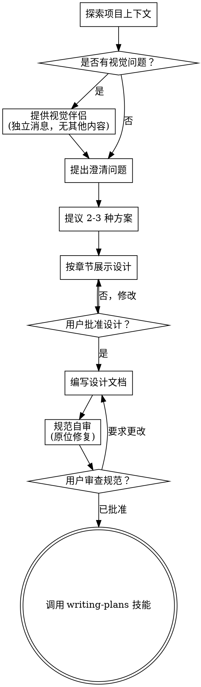

# 头脑风暴：将想法转化为设计 (Brainstorming)

通过自然的协作对话，帮助将想法转化为完全成型的设计和规范。

首先理解当前项目上下文，然后一次提出一个问题来完善想法。一旦你理解了要构建的内容，请展示设计并获得用户批准。

<HARD-GATE>
在你展示设计并获得用户批准之前，不要调用任何实施技能、编写任何代码、搭建任何项目或采取任何实施行动。这适用于每个项目，无论其看起来多么简单。
</HARD-GATE>

## 误区：“这太简单了，不需要设计”

每个项目都要经过这个过程。待办事项列表、单功能实用程序、配置更改 —— 所有这些都需要。在“简单”的项目中，未经检查的假设往往会导致最多的无效工作。设计可以很短（对于真正简单的项目只需几句话），但你必须展示它并获得批准。

## 清单

你必须为以下每个条目创建一个任务并按顺序完成：

1. **探索项目上下文** —— 检查文件、文档、近期提交。
2. **提供视觉伴侣** (如果主题涉及视觉问题) —— 这是一个独立的消息，不与澄清问题合并。请参阅下文的“视觉伴侣”部分。
3. **提出澄清问题** —— 每次一个，理解目的/约束/成功标准。
4. **提议 2-3 种方案** —— 说明权衡取舍并给出你的建议。
5. **展示设计** —— 根据其复杂程度分章节展示，并在每章之后获得用户批准。
6. **编写设计文档** —— 保存至 `docs/superpowers/specs/YYYY-MM-DD-<topic>-design.md` 并提交。
7. **规范自审** —— 快速检查占位符、矛盾点、歧义、范围。
8. **用户审查规范** —— 在继续之前要求用户审查规范文件。
9. **转入实施** —— 调用 writing-plans 技能以创建实施计划。

## 流程图

**终点状态是调用 writing-plans。** 不要调用 frontend-design、mcp-builder 或任何其他实施技能。头脑风暴后唯一调用的技能是 writing-plans。

## 过程

**理解想法：**

- 首先查看当前项目状态（文件、文档、近期提交）。
- 在提出详细问题之前，评估范围：如果请求描述了多个独立的子系统（例如，“构建一个包含聊天、文件存储、计费和分析的平台”），请立即指出。不要在需要先分解的项目上花费时间完善细节。
- 如果项目对于单个规范来说太大，请帮助用户将其分解为子项目：独立的部分有哪些，它们如何关联，应该按什么顺序构建？然后通过正常的设计流程对第一个子项目进行头脑风暴。每个子项目都有自己的“规范 -> 计划 -> 实施”循环。
- 对于范围合适的项目，一次提出一个问题来完善想法。
- 尽可能优先选择多项选择题，但开放式问题也可以。
- 每条消息只提一个问题 —— 如果一个主题需要更多探索，请将其分解为多个问题。
- 重点在于理解：目的、约束、成功标准。

**探索方案：**

- 提议 2-3 种具有不同权衡的方案。
- 以对话方式呈现选项，并附带你的建议和理由。
- 重点介绍你推荐的选项并解释原因。

**展示设计：**

- 一旦你认为理解了要构建的内容，请展示设计。
- 根据复杂程度缩放每个部分：如果是简单的部分，只需几句话；如果是微妙的部分，则最多 200-300 字。
- 在每个部分之后询问目前看起来是否正确。
- 内容涵盖：架构、组件、数据流、错误处理、测试。
- 准备好在出现不明确的情况时回过头进行澄清。

**设计的隔离与清晰：**

- 将系统分解为较小的单元，每个单元都有一个明确的目的，通过定义良好的接口进行通信，并且可以独立地理解和测试。
- 对于每个单元，你应该能够回答：它做什么，如何使用它，以及它依赖于什么？
- 是否有人可以在不阅读单元内部代码的情况下理解它的功能？你是否可以在不破坏调用方的情况下更改内部实现？如果不能，边界就需要进一步调整。
- 较小、边界良好的单元也更容易处理 —— 你可以更好地同时在上下文中思考代码，并且当文件重点明确时，你的编辑也会更可靠。当一个文件变得庞大时，通常预示着它做得太多了。

**在现有代码库中工作：**

- 在提议更改之前探索现有结构。遵循现有模式。
- 如果现有代码存在影响工作的问题（例如，文件变得太大、边界不清晰、职责纠缠），请将有针对性的改进作为设计的一部分 —— 就像优秀的开发人员会改进他们正在处理的代码一样。
- 不要提议无关的重构。专注于服务于当前目标。

## 设计之后

**文档：**

- 将经过验证的设计（规范）写入 `docs/superpowers/specs/YYYY-MM-DD-<topic>-design.md`。
  - (用户对规范位置的偏好会覆盖此默认值)
- 如果可用，请使用 elements-of-style:writing-clearly-and-concisely 技能。
- 将设计文档提交到 git。

**规范自审：**
编写规范文档后，以全新的视角审视它：

1. **占位符扫描：** 是否有“待定”、“TODO”、不完整章节或模糊要求？修复它们。
2. **内部一致性：** 各个部分是否相互矛盾？架构是否与功能描述相符？
3. **范围检查：** 这是否足够集中，可以作为一个实施计划，还是需要分解？
4. **歧义检查：** 是否有任何要求可以有两种不同的解释？如果是，请选择一种并明确说明。

直接原位修复任何问题。无需重新审核 —— 只需修复并继续。

**用户审查门禁：**
在规范自审循环通过后，在继续之前要求用户审查书面规范：

> “规范已编写并提交至 `<path>`。在我们开始编写实施计划之前，请查看它并告诉我你是否想要进行任何更改。”

等待用户响应。如果他们要求更改，请进行更改并重新运行规范审查循环。只有在用户批准后才能继续。

**实施：**

- 调用 writing-plans 技能以创建详细的实施计划。
- 不要调用任何其他技能。writing-plans 是下一步。

## 关键原则

- **一次只提一个问题** —— 不要让多个问题压倒用户。
- **优先选择多项选择题** —— 相比开放式问题，多项选择题通常更容易回答。
- **无情执行 YAGNI** —— 从所有设计中移除不必要的功能。
- **探索替代方案** —— 在确定方案之前，始终提议 2-3 种方案。
- **增量验证** —— 展示设计，在继续之前获得批准。
- **保持灵活性** —— 当某些内容不明确时，回过头进行澄清。

## 视觉伴侣 (Visual Companion)

一个基于浏览器的伴侣工具，用于在头脑风暴期间展示原型图、图表和视觉选项。作为工具可用 —— 而非一种模式。接受该伴侣意味着它可用于受益于视觉展示的问题；这并不意味着每个问题都要通过浏览器处理。

**提供伴侣：** 当你预见到接下来的问题将涉及视觉内容（原型图、布局、图表）时，请提供一次以征得同意：
> “如果我们正在处理的某些内容能通过浏览器展示给你，可能会更容易解释。我可以在处理过程中整理原型图、图表、对比和其他视觉效果。此功能仍处于初级阶段，且可能消耗较多 Token。想要尝试吗？（需要打开本地 URL）”

**此提议必须是独立的消息。** 不要将其与澄清问题、上下文摘要或任何其他内容合并。消息应仅包含上述提议，不含其他内容。等待用户响应后再继续。如果他们拒绝，请继续进行纯文本头脑风暴。

**针对每个问题的决策：** 即使在用户接受后，也要针对每个问题决定是使用浏览器还是终端。测试标准：**用户通过查看是否比阅读能更好地理解这一点？**

- **使用浏览器** 处理本质上是视觉的内容 —— 原型图、线框图、布局对比、架构图、并排视觉设计。
- **使用终端** 处理本质上是文本的内容 —— 需求问题、概念选择、权衡列表、A/B/C/D 文本选项、范围决策。

关于 UI 主题的问题并不自动等同于视觉问题。“在这种语境下个性意味着什么？”是一个概念性问题 —— 使用终端。“哪种向导布局更好？”是一个视觉问题 —— 使用浏览器。

如果他们同意使用伴侣，请在继续之前阅读详细指南：
`skills/brainstorming/visual-companion.md`
