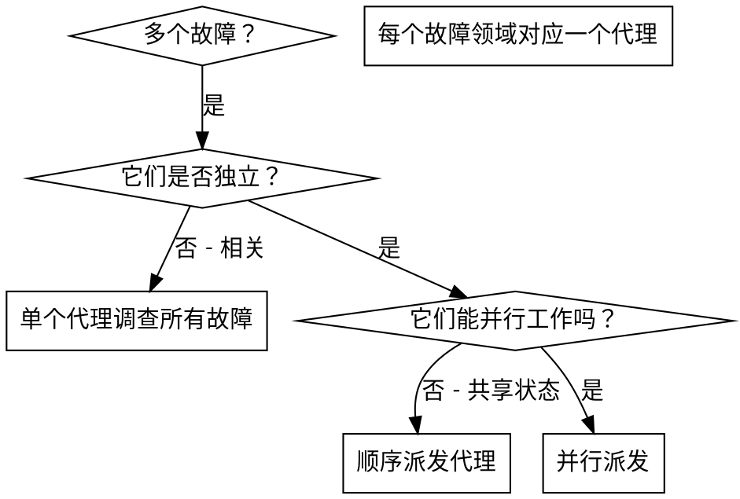

# 派遣并行代理 (Dispatching Parallel Agents)

## 概述

你将任务委托给具有隔离上下文的专业代理。通过精确构建其指令和上下文，你可以确保他们专注于并成功完成任务。他们永远不应该继承你当前会话的上下文或历史 —— 你应当准确构建他们所需要的内容。这也为你保留了用于协调工作的上下文。

当你遇到多个互不相关的故障（不同的测试文件、不同的子系统、不同的 bug）时，按顺序调查会浪费时间。每项调查都是独立的，可以并行进行。

**核心原则：** 为每个独立的故障领域派发一个代理。让他们并发工作。

## 何时使用



**在以下情况下使用：**
- 3 个以上测试文件失败，且根本原因各不相同。
- 多个子系统独立损坏。
- 每个问题都可以在不依赖其他问题上下文的情况下被理解。
- 各项调查之间没有共享状态。

**在以下情况下不要使用：**
- 故障是相关的（修复一个可能会修复其他故障）。
- 需要理解完整的系统状态。
- 代理之间会互相干扰。

## 模式

### 1. 识别独立领域

按损坏的内容对故障进行分组：
- 文件 A 测试：工具审批流
- 文件 B 测试：批量完成行为
- 文件 C 测试：中止功能

每个领域都是独立的 —— 修复工具审批不会影响中止测试。

### 2. 创建集中的代理任务

每个代理获得：
- **特定范围：** 一个测试文件或子系统。
- **明确目标：** 使这些测试通过。
- **约束：** 不要更改其他代码。
- **预期输出：** 你发现并修复的内容摘要。

### 3. 并行派发

```typescript
// 在 Claude Code / AI 环境中
Task("修复 agent-tool-abort.test.ts 的失败项")
Task("修复 batch-completion-behavior.test.ts 的失败项")
Task("修复 tool-approval-race-conditions.test.ts 的失败项")
// 这三个任务会并发运行
```

### 4. 审查与集成

当代理返回结果时：
- 阅读每份摘要。
- 验证修复方案是否冲突。
- 运行完整的测试套件。
- 集成所有变更。

## 代理提示词结构

优秀的代理提示词具有以下特点：
1. **集中** —— 一个清晰的问题领域。
2. **自给自足** —— 包含理解问题所需的所有上下文。
3. **输出明确** —— 代理应该返回什么？

```markdown
修复 src/agents/agent-tool-abort.test.ts 中的 3 个失败测试：

1. "should abort tool with partial output capture" - 预期消息中包含 'interrupted at'
2. "should handle mixed completed and aborted tools" - 快速工具被中止而非完成
3. "should properly track pendingToolCount" - 预期 3 个结果但得到 0 个

这些是时序/竞态条件问题。你的任务：

1. 阅读测试文件并理解每个测试验证的内容。
2. 识别根本原因 —— 是时序问题还是实际的 bug？
3. 通过以下方式修复：
   - 使用基于事件的等待取代随机的超时 (timeouts)。
   - 如果发现中止实现中存在 bug，请予以修复。
   - 如果行为发生了变更，请调整测试预期。

严禁仅仅通过增加超时时间来修复 —— 找到真正的问题。

返回：你发现的问题以及你修复的内容的摘要。
```

## 常见错误

**❌ 太广泛：** “修复所有测试” —— 代理会迷失方向。
**✅ 具体：** “修复 agent-tool-abort.test.ts” —— 范围集中。

**❌ 无上下文：** “修复竞态条件” —— 代理不知道在哪里修复。
**✅ 有上下文：** 粘贴错误信息和测试名称。

**❌ 无约束：** 代理可能会重构所有内容。
**✅ 有约束：** “不要更改生产代码”或“仅修复测试”。

**❌ 输出模糊：** “修复它” —— 你不知道更改了什么。
**✅ 具体：** “返回根本原因和变更内容的摘要”。

## 何时不要使用

**相关的故障：** 修复一个可能会修复其他故障 —— 先一起调查。
**需要完整上下文：** 理解问题需要查看整个系统。
**探索性调试：** 你还不知道哪里坏了。
**共享状态：** 代理会互相干扰（编辑相同的文件、使用相同的资源）。

## 会话中的真实案例

**场景：** 重大重构后，3 个文件中出现了 6 个测试失败。

**故障项：**
- agent-tool-abort.test.ts: 3 个失败（时序问题）
- batch-completion-behavior.test.ts: 2 个失败（工具未执行）
- tool-approval-race-conditions.test.ts: 1 个失败（执行计数 = 0）

**决策：** 独立领域 —— 中止逻辑、批量完成和竞态条件分别是独立的。

**派发：**
```
代理 1 → 修复 agent-tool-abort.test.ts
代理 2 → 修复 batch-completion-behavior.test.ts
代理 3 → 修复 tool-approval-race-conditions.test.ts
```

**结果：**
- 代理 1：使用基于事件的等待取代了超时。
- 代理 2：修复了事件结构 bug（threadId 放置位置错误）。
- 代理 3：添加了对异步工具执行完成的等待。

**集成：** 所有修复都是独立的，无冲突，完整套件测试全绿。

**节省时间：** 3 个问题并行解决，而非顺序解决。

## 主要收益

1. **并行化** —— 多项调查同时进行。
2. **专注** —— 每个代理的范围较窄，需要追踪的上下文较少。
3. **独立性** —— 代理之间互不干扰。
4. **速度** —— 在解决 1 个问题的时间内解决了 3 个问题。

## 验证

在代理返回结果后：
1. **审查每份摘要** —— 理解更改了什么。
2. **检查冲突** —— 代理是否编辑了相同的代码？
3. **运行完整套件** —— 验证所有修复方案能协同工作。
4. **抽样检查** —— 代理可能会犯系统性错误。

## 现实影响

来自调试会话 (2025-10-03)：
- 3 个文件中出现了 6 个故障。
- 并行派发了 3 个代理。
- 所有调查并发完成。
- 所有修复方案成功集成。
- 代理变更之间零冲突。
