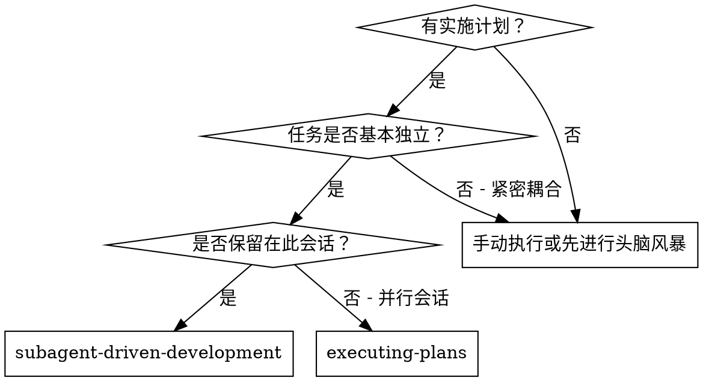
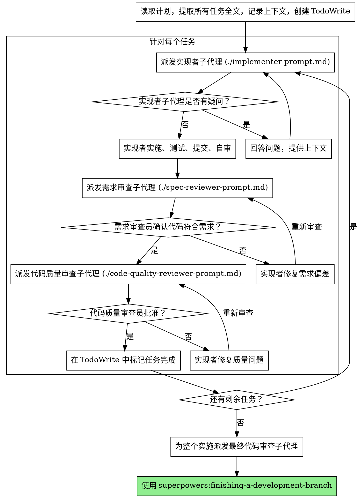

# 子代理驱动开发 (Subagent-Driven Development)

通过为每个任务派发新鲜的子代理来执行计划，并在每个任务后进行两阶段审查：首先是需求合规性审查（spec compliance review），然后是代码质量审查（code quality review）。

**为什么使用子代理：** 你将任务委托给具有隔离上下文的专业代理。通过精确构建指令和上下文，你可以确保他们专注于并成功完成任务。他们永远不应该继承你当前会话的上下文或历史 —— 你应当准确构建他们所需要的内容。这也为你保留了用于协调工作的上下文。

**核心原则：** 为每个任务派遣新鲜子代理 + 两阶段审查（需求审查 -> 质量审查）= 高质量、快速迭代。

## 何时使用



**与“执行计划 (并行会话)”相比：**
- 同一会话（无需切换上下文）
- 每个任务对应一个新鲜子代理（无上下文污染）
- 每个任务后进行两阶段审查：首先是需求合规性，然后是代码质量
- 迭代更快（任务之间无需人工干预）

## 流程



## 模型选择

为每个角色选择能胜任该工作的最廉价模型，以节省成本并提高速度。

**机械式实施任务** (孤立的函数、清晰的规范、1-2 个文件)：使用快速、廉价的模型。当计划被明确指定时，大多数实施任务都是机械性的。

**集成和判断任务** (多文件协调、模式匹配、调试)：使用标准模型。

**架构、设计和审查任务**：使用最强大的可用模型。

**任务复杂度信号：**
- 涉及 1-2 个文件且规范完整 → 廉价模型
- 涉及多个文件且有集成顾虑 → 标准模型
- 需要设计判断或对代码库有广泛理解 → 最强模型

## 处理实现者状态

实现者子代理会报告以下四种状态之一。请妥善处理：

**DONE (完成)：** 继续进行需求合规性审查。

**DONE_WITH_CONCERNS (完成但有顾虑)：** 实现者完成了工作但标记了疑虑。在继续之前阅读这些顾虑。如果顾虑涉及正确性或范围，请在审查前解决它们。如果是观察结果（例如，“这个文件正变得庞大”），请记录下来并继续进行审查。

**NEEDS_CONTEXT (需要上下文)：** 实现者需要尚未提供的信息。提供缺失的上下文并重新派发。

**BLOCKED (被阻塞)：** 实现者无法完成任务。评估阻塞原因：
1. 如果是上下文问题，提供更多上下文并使用相同的模型重新派发
2. 如果任务需要更多推理，使用更强大的模型重新派发
3. 如果任务太大，将其拆分为较小的部分
4. 如果计划本身有误，升级给人类处理

**切勿** 忽略升级或在没有更改的情况下强制同一模型重试。如果实现者表示卡住了，说明有些东西需要改变。

## 提示词模板

- `./implementer-prompt.md` - 派发实现者子代理
- `./spec-reviewer-prompt.md` - 派发需求合规性审查员子代理
- `./code-quality-reviewer-prompt.md` - 派发代码质量审查员子代理

## 示例工作流

```
你：我正在使用子代理驱动开发来执行此计划。

[读取计划文件一次：docs/superpowers/plans/feature-plan.md]
[提取所有 5 个任务及其全文和上下文]
[创建包含所有任务的 TodoWrite]

任务 1: Hook 安装脚本

[获取任务 1 的文本和上下文（已提取）]
[通过任务全文 + 上下文派发实现子代理]

实现者：“在我开始之前 —— 钩子应该安装在用户级别还是系统级别？”

你：“用户级别 (~/.config/superpowers/hooks/)”

实现者：“明白了。现在开始实施...”
[稍后] 实现者：
  - 实施了 install-hook 命令
  - 添加了测试，5/5 通过
  - 自审：发现漏掉了 --force 标志，已添加
  - 已提交

[派发需求合规性审查员]
需求审查员：✅ 符合规范 —— 满足所有要求，没有额外内容

[获取 git SHA，派发代码质量审查员]
代码审查员：优点：良好的测试覆盖率，简洁。问题：无。批准。

[标记任务 1 完成]

任务 2: 恢复模式

[获取任务 2 的文本和上下文（已提取）]
[通过任务全文 + 上下文派发实现子代理]

实现者：[没有疑问，继续执行]
实现者：
  - 添加了 verify/repair 模式
  - 8/8 测试通过
  - 自审：一切正常
  - 已提交

[派发需求合规性审查员]
需求审查员：❌ 问题：
  - 遗漏：进度报告（规范要求“每 100 个条目报告一次”）
  - 额外：添加了 --json 标志（未要求）

[实现者修复问题]
实现者：移除了 --json 标志，添加了进度报告

[需求审查员再次审查]
需求审查员：✅ 现在符合规范了

[派发代码质量审查员]
代码审查员：优点：稳健。问题（重要）：魔法数字 (100)

[实现者修复]
实现者：提取了 PROGRESS_INTERVAL 常量

[代码质量审查员再次审查]
代码质量审查员：✅ 批准

[标记任务 2 完成]

...

[所有任务完成后]
[派发最终代码审查员]
最终审查员：满足所有要求，准备合并

完成！
```

## 优势

**与手动执行相比：**
- 子代理自然遵循 TDD
- 每个任务都有新鲜的上下文（无混淆）
- 并行安全（子代理互不干扰）
- 子代理可以提问（在工作之前和期间）

**与“执行计划”相比：**
- 同一会话（无移交）
- 持续进展（无需等待）
- 自动审查检查点

**效率提升：**
- 无文件读取开销（控制器提供全文）
- 控制器精确策划所需的上下文
- 子代理预先获得完整信息
- 问题在工作开始前浮出水面（而非之后）

**质量门禁：**
- 自审在移交前发现问题
- 两阶段审查：需求合规性，然后是代码质量
- 审查循环确保修复确实有效
- 需求合规性防止过度构建或构建不足
- 代码质量确保实施方案构建良好

**成本：**
- 更多的子代理调用（每个任务一个实现者 + 两个审查员）
- 控制器做更多的准备工作（预先提取所有任务）
- 审查循环增加了迭代次数
- 但能及早发现问题（比以后调试更便宜）

## 红旗信号

**绝不：**
- 在没有用户明确同意的情况下在 main/master 分支开始实施
- 跳过审查（需求合规性 或 代码质量）
- 在问题未修复的情况下继续推进
- 并行派发多个实现子代理（冲突）
- 让子代理读取计划文件（应提供全文）
- 跳过背景上下文（子代理需要理解任务所属的位置）
- 忽略子代理的问题（在允许他们继续之前先回答问题）
- 在需求合规性上接受“差不多就行”（需求审查员发现问题 = 未完成）
- 跳过审查循环（审查员发现问题 = 实现者修复 = 再次审查）
- 让实现者的自审取代实际审查（两者都需要）
- **在需求合规性获得 ✅ 之前开始代码质量审查**（顺序错误）
- 在任何审查仍有未解决问题时进入下一个任务

**如果子代理提问：**
- 清晰完整地回答
- 如果需要，提供额外的上下文
- 不要催促他们进入实施阶段

**如果审查员发现问题：**
- 实现者（同一个子代理）进行修复
- 审查员再次审查
- 重复直到获得批准
- 不要跳过重新审查步骤

**如果子代理任务失败：**
- 派发带有特定指令的修复子代理
- 不要尝试手动修复（上下文污染）

## 集成

**必需的工作流技能：**
- **superpowers:using-git-worktrees** —— 必需：在开始前设置隔离的工作空间
- **superpowers:writing-plans** —— 创建此技能执行的计划
- **superpowers:requesting-code-review** —— 用于审查员子代理的代码审查模板
- **superpowers:finishing-a-development-branch** —— 在所有任务完成后完成开发

**子代理应使用：**
- **superpowers:test-driven-development** —— 子代理针对每个任务遵循 TDD

**替代工作流：**
- **superpowers:executing-plans** —— 用于并行会话而非同一会话执行
