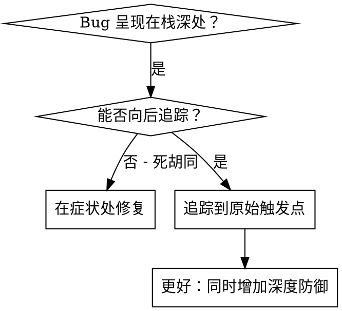
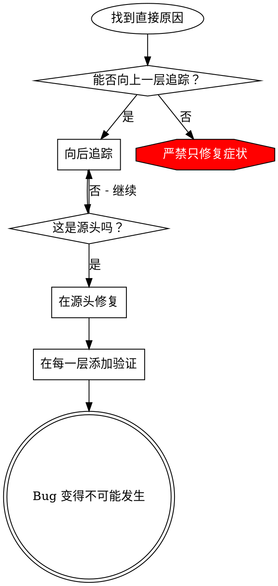

# 根本原因追踪 (Root Cause Tracing)

## 概述

Bug 往往表现在调用栈的深处（例如：在错误的目录下执行 git init、在错误的位置创建文件、以错误的路径打开数据库）。你的本能可能是修复错误出现的地方，但这只是在治疗症状。

**核心原则：** 沿着调用链向后追踪，直到找到原始触发点，然后在源头进行修复。

## 何时使用



**在以下情况下使用：**
- 错误发生在执行的深层（而非入口点）。
- 堆栈跟踪显示了很长的调用链。
- 不清楚无效数据的来源。
- 需要找出是哪个测试/哪段代码触发了该问题。

## 追踪流程

### 1. 观察症状
```
Error: git init failed in /Users/jesse/project/packages/core
```

### 2. 寻找直接原因
**哪段代码直接导致了此结果？**
```typescript
await execFileAsync('git', ['init'], { cwd: projectDir });
```

### 3. 询问：是什么调用了它？
```typescript
WorktreeManager.createSessionWorktree(projectDir, sessionId)
  → 由 Session.initializeWorkspace() 调用
  → 由 Session.create() 调用
  → 由 Project.create() 处的测试调用
```

### 4. 继续向上追踪
**传递了什么值？**
- `projectDir = ''` (空字符串！)
- 空字符串作为 `cwd` 会被解析为 `process.cwd()`。
- 那是源代码目录！

### 5. 找到原始触发点
**空字符串是从哪里来的？**
```typescript
const context = setupCoreTest(); // 返回 { tempDir: '' }
Project.create('name', context.tempDir); // 在 beforeEach 之前就被访问了！
```

## 添加堆栈跟踪

当你无法手动追踪时，添加监测代码：

```typescript
// 在出问题的操作之前
async function gitInit(directory: string) {
  const stack = new Error().stack;
  console.error('DEBUG git init:', {
    directory,
    cwd: process.cwd(),
    nodeEnv: process.env.NODE_ENV,
    stack,
  });

  await execFileAsync('git', ['init'], { cwd: directory });
}
```

**关键点：** 在测试中使用 `console.error()`（不要使用日志记录器 —— 日志可能不会显示出来）。

**运行并捕获：**
```bash
npm test 2>&1 | grep 'DEBUG git init'
```

**分析堆栈跟踪：**
- 寻找测试文件的名称。
- 找到触发调用的行号。
- 识别模式（是同一个测试吗？参数相同吗？）。

## 寻找导致污染的测试

如果在测试期间出现了某些情况，但你不知道是哪个测试导致的：

使用本目录下的二分搜索脚本 `find-polluter.sh`：

```bash
./find-polluter.sh '.git' 'src/**/*.test.ts'
```

它会逐个运行测试，并在遇到第一个污染物时停止。用法见脚本说明。

## 真实案例：空的 projectDir

**症状：** 在 `packages/core/`（源代码目录）中创建了 `.git`。

**追踪链：**
1. `git init` 在 `process.cwd()` 中运行 ← 空的 cwd 参数。
2. WorktreeManager 被调用，传入了空的 projectDir。
3. Session.create() 被传入了空字符串。
4. 测试在 beforeEach 之前访问了 `context.tempDir`。
5. setupCoreTest() 最初返回 `{ tempDir: '' }`。

**根本原因：** 顶级变量初始化访问了空值。

**修复方案：** 将 tempDir 改为 getter，如果在 beforeEach 之前访问则抛出错误。

**同时增加了深度防御 (Defense-in-Depth)：**
- 第 1 层：Project.create() 验证目录。
- 第 2 层：WorkspaceManager 验证路径非空。
- 第 3 层：NODE_ENV 守卫，拒绝在 tmpdir 之外执行 git init。
- 第 4 层：在 git init 之前记录堆栈跟踪日志。

## 核心原则



**严禁只修复错误出现的地方。** 务必向后追踪以找到原始触发点。

## 堆栈跟踪小贴士

**在测试中：** 使用 `console.error()` 而非日志记录器 —— 日志可能会被抑制。
**操作前：** 在危险操作之前记录日志，而不是在它失败后。
**包含上下文：** 目录、当前工作目录 (cwd)、环境变量、时间戳。
**捕获栈信息：** `new Error().stack` 会显示完整的调用链。

## 现实影响

来自调试会话 (2025-10-03)：
- 通过 5 层追踪找到了根本原因。
- 在源头进行了修复（getter 验证）。
- 增加了 4 层防御。
- 1847 个测试通过，零污染。
