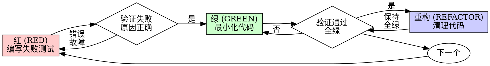

# 测试驱动开发 (TDD)

## 概述

先写测试。观察它失败。编写最小化代码使之通过。

**核心原则：** 如果你没有亲眼看到测试失败，你就不知道它是否测试了正确的东西。

**违反这些规则的具体条文即是违反规则的精神。**

## 何时使用

**始终使用：**
- 新功能
- Bug 修复
- 重构
- 行为变更

**例外情况（请询问你的伙伴）：**
- 临时原型
- 生成的代码
- 配置文件

想要“就这一次跳过 TDD”？停止。那是找借口合理化。

## 铁律

```
在没有失败的测试之前，严禁编写生产代码
```

先写代码再写测试？删掉它。重新开始。

**没有例外：**
- 不要把它作为“参考”保留。
- 不要在写测试时“适配”它。
- 不要看它。
- 删除意味着彻底消失。

从测试出发重新实施。句号。

## 红-绿-重构 (Red-Green-Refactor)



### 红 (RED) —— 编写失败测试

编写一个最小化的测试来展示预期的行为。

<Good>
```typescript
test('失败的操作重试 3 次', async () => {
  let attempts = 0;
  const operation = () => {
    attempts++;
    if (attempts < 3) throw new Error('fail');
    return 'success';
  };

  const result = await retryOperation(operation);

  expect(result).toBe('success');
  expect(attempts).toBe(3);
});
```
名称清晰，测试真实行为，只测一件事。
</Good>

<Bad>
```typescript
test('重试正常工作', async () => {
  const mock = jest.fn()
    .mockRejectedValueOnce(new Error())
    .mockRejectedValueOnce(new Error())
    .mockResolvedValueOnce('success');
  await retryOperation(mock);
  expect(mock).toHaveBeenCalledTimes(3);
});
```
名称模糊，测试的是 mock 而非代码逻辑。
</Bad>

**要求：**
- 测一个行为。
- 名称清晰。
- 真实代码（除非不可避免，否则不要使用 mock）。

### 验证“红” —— 观察它失败

**强制性要求。绝不跳过。**

```bash
npm test path/to/test.test.ts
```

确认：
- 测试失败（而非由于代码错误导致运行失败）。
- 失败信息符合预期。
- 失败原因是功能缺失（而非由于拼写错误）。

**测试通过了？** 说明你在测试现有的行为。请修正测试。

**测试运行报错？** 修正错误，重新运行直到它正确地失败。

### 绿 (GREEN) —— 最小化代码

编写最简单的代码使测试通过。

<Good>
```typescript
async function retryOperation<T>(fn: () => Promise<T>): Promise<T> {
  for (let i = 0; i < 3; i++) {
    try {
      return await fn();
    } catch (e) {
      if (i === 2) throw e;
    }
  }
  throw new Error('unreachable');
}
```
刚好足够让测试通过。
</Good>

<Bad>
```typescript
async function retryOperation<T>(
  fn: () => Promise<T>,
  options?: {
    maxRetries?: number;
    backoff?: 'linear' | 'exponential';
    onRetry?: (attempt: number) => void;
  }
): Promise<T> {
  // YAGNI - 现在还不需要这些
}
```
过度设计。
</Bad>

不要添加功能、重构其他代码或进行超出测试要求的“改进”。

### 验证“绿” —— 观察它通过

**强制性要求。**

```bash
npm test path/to/test.test.ts
```

确认：
- 该测试通过。
- 其他测试仍然通过。
- 输出内容整洁（无错误、无警告）。

**测试失败了？** 修正代码，而不是修改测试。

**其他测试失败了？** 立即修复。

### 重构 (REFACTOR) —— 清理代码

仅在变绿之后进行：
- 消除重复。
- 改进命名。
- 提取助手函数。

保持测试为绿色。不要添加新行为。

### 重复

为下一个功能编写下一个失败测试。

## 优秀的测试

| 质量 | 优 | 劣 |
|---------|------|-----|
| **最小化** | 只测一件事。名称中有 "and"？请拆分。 | `test('验证电子邮件、域名和空格')` |
| **清晰** | 名称描述行为。 | `test('test1')` |
| **显示意图** | 演示期望的 API 用法。 | 掩盖了代码应该做什么。 |

## 为什么顺序至关重要

**“我会在代码写完后再写测试来验证它是否工作”**

代码写完后再写的测试会立即通过。立即通过证明不了任何事情：
- 可能测错了东西。
- 可能测的是实现方式，而非预期行为。
- 可能漏掉了你忘记的边缘情况。
- 你从未亲眼看到它捕获 bug。

先写测试迫使你亲历测试失败，从而证明它确实在测试某些东西。

**“我已经手动测试了所有的边缘情况”**

手动测试是随意的。你以为你测试了一切，但：
- 没有你测试内容的记录。
- 代码更改时无法重新运行。
- 在压力下容易遗漏情况。
- “我尝试时它工作正常” ≠ 全面。

自动化测试是系统化的。它们每次都以相同的方式运行。

**“删掉 X 小时的工作是浪费”**

沉没成本谬误。时间已经流逝。你现在的选择：
- 删除并使用 TDD 重新编写（多花 X 小时，高度自信）。
- 保留它并在之后添加测试（30 分钟，低自信，很可能有 bug）。

真正的“浪费”是保留你无法信任的代码。没有真实测试的运行代码就是技术债。

**“TDD 是教条，务实意味着灵活适配”**

TDD **就是** 务实：
- 在提交前发现 bug（比之后调试更快）。
- 防止回归（测试能立即发现破坏点）。
- 记录行为（测试展示了如何使用代码）。
- 支持重构（自由更改，测试能捕获破坏点）。

“务实”的捷径 = 在生产环境中调试 = 更慢。

**“事后测试也能达到同样的目标 —— 重要的是精神而非形式”**

不。事后测试回答的是“这段代码在做什么？”，而先行测试回答的是“这段代码应该做什么？”。

事后测试会受到你实现方式的偏见影响。你测试的是你构建出来的东西，而不是要求的。你验证的是你记得的边缘情况，而不是被发现的情况。

先行测试迫使你在实施前发现边缘情况。事后测试只是验证你是否记得所有事情（通常你记不住）。

事后补 30 分钟测试 ≠ TDD。你得到了覆盖率，却失去了证明测试有效的证据。

## 常见的借口

| 借口 | 现实 |
|--------|---------|
| “太简单了，不需要测试” | 简单的代码也会崩溃。测试只需 30 秒。 |
| “我稍后补测” | 立即通过的测试证明不了任何事情。 |
| “事后测试目标一致” | 事后测试 = “在做什么？”，先行测试 = “应该做什么？” |
| “已经手动测试过了” | 随意测试 ≠ 系统化。无记录，无法重跑。 |
| “删掉 X 小时太浪费” | 沉没成本谬误。保留未经证实的逻辑是技术债。 |
| “留作参考，先写测试” | 你会忍不住去适配它。那就是事后测试。删除意味着彻底消失。 |
| “需要先探索一下” | 没问题。丢弃探索的代码，从 TDD 开始正式工作。 |
| “测试太难 = 设计不明” | 听听测试怎么说。难测的代码就难用。 |
| “TDD 会拖慢我” | TDD 比调试快。务实 = 先写测试。 |
| “手动测试更快” | 手动测试证明不了边缘情况。每次变更你都得重测。 |
| “现有代码没测试” | 你在改进它。为现有代码补上测试。 |

## 红旗信号 —— 停止并重新开始

- 先写代码再写测试。
- 实施后才写测试。
- 测试立即通过。
- 无法解释测试为什么失败。
- “稍后”添加测试。
- 找借口“就这一次”。
- “我已经手动测试过了”。
- “事后测试的目的也是一样的”。
- “重要的是精神而非形式”。
- “留作参考”或“适配现有代码”。
- “已经花了 X 小时，删除太浪费”。
- “TDD 是教条，我很务实”。
- “这次情况不同，因为……”

**所有这些都意味着：删除代码。使用 TDD 重新开始。**

## 示例：Bug 修复

**Bug：** 接受了空的电子邮件地址。

**红 (RED)**
```typescript
test('拒绝空的电子邮件', async () => {
  const result = await submitForm({ email: '' });
  expect(result.error).toBe('Email required');
});
```

**验证“红”**
```bash
$ npm test
FAIL: expected 'Email required', got undefined
```

**绿 (GREEN)**
```typescript
function submitForm(data: FormData) {
  if (!data.email?.trim()) {
    return { error: 'Email required' };
  }
  // ...
}
```

**验证“绿”**
```bash
$ npm test
PASS
```

**重构 (REFACTOR)**
如果需要，为多个字段提取验证逻辑。

## 验证清单

在标记工作完成之前：

- [ ] 每个新函数/方法都有对应的测试。
- [ ] 在实施前亲眼看到了每个测试失败。
- [ ] 每个测试都由于预期的原因失败（功能缺失，而非拼写错误）。
- [ ] 为通过每个测试编写了最小化代码。
- [ ] 所有测试均通过。
- [ ] 输出内容整洁（无错误、无警告）。
- [ ] 测试使用的是真实代码（除非不可避免，否则不使用 mock）。
- [ ] 覆盖了边缘情况和错误处理。

无法勾选所有选项？说明你跳过了 TDD。重新开始。

## 陷入困境时

| 问题 | 解决方案 |
|---------|----------|
| 不知道如何测试 | 编写你期望的 API。先写断言 (assertion)。询问你的伙伴。 |
| 测试太复杂 | 设计太复杂。简化接口。 |
| 必须 mock 一切 | 代码耦合度太高。使用依赖注入。 |
| 测试设置 (setup) 太庞大 | 提取助手函数。仍然复杂？简化设计。 |

## 调试集成

发现 bug 了？编写一个能复现它的失败测试。遵循 TDD 循环。测试能证明修复有效并防止回归。

严禁在没有测试的情况下修复 bug。

## 测试反模式

在添加 mock 或测试工具时，请阅读 @testing-anti-patterns.md 以避免常见陷阱：
- 测试的是 mock 的行为而非真实行为。
- 在生产类中添加仅供测试使用的方法。
- 在不理解依赖关系的情况下进行 mock。

## 最终规则

```
生产代码 → 存在测试且该测试先失败了
否则 → 不是 TDD
```

未经你的伙伴许可，没有例外。
