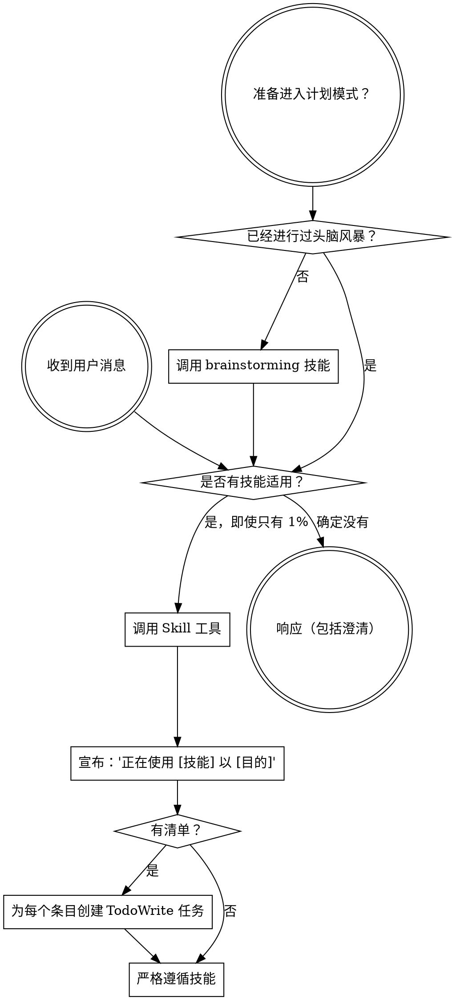

<SUBAGENT-STOP>
如果你是以子代理（subagent）身份派发来执行特定任务的，请跳过此技能。
</SUBAGENT-STOP>

<EXTREMELY-IMPORTANT>
如果你认为有哪怕 1% 的可能性某个技能适用于你正在做的事情，你 **绝对必须** 调用该技能。

如果某个技能适用于你的任务，你别无选择。你 **必须** 使用它。

这是不可协商的。这不是可选的。你不能找借口规避。
</EXTREMELY-IMPORTANT>

## 指令优先级

Superpowers 技能会覆盖默认的系统提示词行为，但 **用户指令始终具有最高优先级**：

1. **用户的显式指令** (CLAUDE.md, GEMINI.md, AGENTS.md, 直接请求) —— 最高优先级
2. **Superpowers 技能** —— 在冲突时覆盖默认系统行为
3. **默认系统提示词** —— 最低优先级

如果 CLAUDE.md、GEMINI.md 或 AGENTS.md 说“不要使用 TDD”，而某个技能说“始终使用 TDD”，请遵循用户的指令。用户拥有控制权。

## 如何访问技能

**在 Claude Code 中：** 使用 `Skill` 工具。当你调用技能时，其内容将被加载并呈现给你 —— 请直接遵循。切勿对技能文件使用 Read 工具。

**在 Copilot CLI 中：** 使用 `skill` 工具。技能会从已安装的插件中自动发现。`skill` 工具的工作方式与 Claude Code 的 `Skill` 工具相同。

**在 Gemini CLI 中：** 技能通过 `activate_skill` 工具激活。Gemini 在会话开始时加载技能元数据，并根据需要按需激活完整内容。

**在其他环境中：** 请查看你的平台文档，了解技能是如何加载的。

## 平台适配

技能使用 Claude Code 的工具名称。非 CC 平台：请参阅 `references/copilot-tools.md` (Copilot CLI)、`references/codex-tools.md` (Codex) 获取等效工具。Gemini CLI 用户将通过 GEMINI.md 自动加载工具映射。

# 使用技能

## 规则

**在进行任何响应或行动之前，先调用相关或要求的技能。** 即使只有 1% 的可能性适用，也意味着你应该调用该技能进行检查。如果调用的技能发现不适用于当前情况，你不需要使用它。

## 红旗信号

这些想法意味着停止 —— 你在找借口合理化：

| 想法 | 现实 |
|---------|---------|
| “这只是个简单的问题” | 问题也是任务。检查技能。 |
| “我需要先获取更多上下文” | 技能检查应在澄清问题之前。 |
| “让我先探索一下代码库” | 技能会告诉你如何探索。先检查。 |
| “我可以快速检查 git/文件” | 文件缺乏对话上下文。检查技能。 |
| “让我先收集信息” | 技能会告诉你如何收集信息。 |
| “这不需要正式的技能” | 如果存在技能，就使用它。 |
| “我记得这个技能” | 技能在进化。阅读当前版本。 |
| “这不算是一个任务” | 行动 = 任务。检查技能。 |
| “这个技能大材小用了” | 简单的事情也会变得复杂。使用它。 |
| “我先做这一件事” | 在做任何事之前先检查。 |
| “这感觉很有成效” | 不守纪律的行动会浪费时间。技能可以防止这种情况。 |
| “我知道那是什么意思” | 了解概念 ≠ 使用技能。调用它。 |

## 技能优先级

当多个技能可能适用时，请遵循以下顺序：

1. **流程类技能优先** (brainstorming, debugging) —— 这些决定了如何处理任务。
2. **实施类技能次之** (frontend-design, mcp-builder) —— 这些指导具体执行。

“让我们构建 X” → 先头脑风暴，然后是实施类技能。
“修复此 bug” → 先调试，然后是特定领域的技能。

## 技能类型

**刚性 (Rigid)** (TDD, debugging): 严格遵循。不要因环境而放弃纪律。

**灵活 (Flexible)** (patterns): 将原则适配到上下文中。

技能本身会告诉你它是哪种类型。

## 用户指令

指令说明“做什么”，而不是“怎么做”。“添加 X”或“修复 Y”并不意味着跳过工作流。
