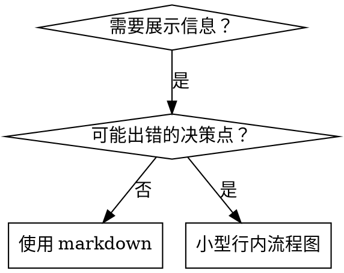

# 编写技能 (Writing Skills)

## 概述

**编写技能是应用于流程文档的测试驱动开发 (TDD)。**

**个人技能存放在代理特定的目录中（Claude Code 为 `~/.claude/skills`，Codex 为 `~/.agents/skills/`）。**

你编写测试用例（使用子代理的压力场景），观察它们失败（基准线行为），编写技能（文档），观察测试通过（代理遵守规则），然后进行重构（堵住漏洞）。

**核心原则：** 如果你没有亲眼看到代理在没有该技能的情况下失败，你就不知道该技能是否传授了正确的东西。

**必需背景：** 在使用此技能之前，你 **必须** 理解 superpowers:test-driven-development。该技能定义了基本的“红-绿-重构”循环。本技能将 TDD 适配到了文档编写中。

**官方指导：** 有关 Anthropic 官方的技能创作最佳实践，请参阅 `anthropic-best-practices.md`。该文档提供了补充本技能中以 TDD 为核心的方法的其他模式和指南。

## 什么是技能？

**技能** 是针对经过证实的技巧、模式或工具的参考指南。技能可以帮助未来的 Claude 实例发现并应用有效的方法。

**技能是：** 可重用的技巧、模式、工具、参考指南。

**技能不是：** 关于你曾如何解决某个问题的叙事性描述。

## 技能创作的 TDD 映射

| TDD 概念 | 技能创作 |
|-------------|----------------|
| **测试用例** | 使用子代理的压力场景 |
| **生产代码** | 技能文档 (SKILL.md) |
| **测试失败 (红)** | 代理在无技能的情况下违反规则（基准线） |
| **测试通过 (绿)** | 代理在存在技能的情况下遵守规则 |
| **重构** | 在保持合规性的同时堵住漏洞 |
| **先写测试** | 在编写技能之前运行基准线场景 |
| **观察失败** | 记录代理使用的确切借口/合理化辞令 |
| **最小化代码** | 编写针对这些特定违规行为的技能 |
| **观察通过** | 验证代理现在已合规 |
| **重构循环** | 寻找新的借口 → 填补 → 重新验证 |

整个技能创作过程遵循“红-绿-重构”。

## 何时创建技能

**在以下情况下创建：**
- 该技巧对你来说并非直观显见。
- 你会在跨项目的工作中再次参考它。
- 该模式具有广泛的适用性（非特定于某个项目）。
- 他人能从中受益。

**不要为以下情况创建：**
- 一次性的解决方案。
- 在其他地方已有详细文档的标准做法。
- 特定于项目的惯例（请放入 CLAUDE.md）。
- 机械性的约束（如果可以通过正则/验证进行强制执行，请将其自动化 —— 将文档留给需要判断力的地方）。

## 技能类型

### 技巧 (Technique)
具有具体执行步骤的方法（condition-based-waiting, root-cause-tracing）。

### 模式 (Pattern)
思考问题的方式（flatten-with-flags, test-invariants）。

### 参考 (Reference)
API 文档、语法指南、工具文档（office docs）。

## 目录结构


```
skills/
  skill-name/
    SKILL.md              # 主参考文档（必需）
    supporting-file.*     # 仅在需要时提供
```

**扁平命名空间** —— 所有技能都位于一个可搜索的命名空间中。

**针对以下内容使用独立文件：**
1. **重型参考资料** (100 行以上) —— API 文档、综合语法。
2. **可重用工具** —— 脚本、实用程序、模板。

**保持行内 (Inline)：**
- 原则和概念。
- 代码模式 (少于 50 行)。
- 其他所有内容。

## SKILL.md 结构

**前置属性 (Frontmatter, YAML)：**
- 两个必需字段：`name` 和 `description`（有关所有受支持字段，请参阅 [agentskills.io/specification](https://agentskills.io/specification)）。
- 总计最多 1024 个字符。
- `name`：仅使用字母、数字和连字符（不含括号、特殊字符）。
- `description`：以第三人称描述，**仅** 说明何时使用（**不** 说明它的功能）。
  - 以 "Use when..." 开头，专注于触发条件。
  - 包含具体的症状、情境和上下文。
  - **严禁总结技能的流程或工作流**（原因见 CSO 章节）。
  - 尽可能保持在 500 个字符以内。

```markdown
---
name: Skill-Name-With-Hyphens
description: Use when [具体的触发条件和症状]
---

# 技能名称

## 概述
这是什么？用 1-2 句话说明核心原则。

## 何时使用
[如果决策不明显，可在此处提供行内流程图]

包含症状和用例的列表
何时不使用

## 核心模式 (针对技巧/模式)
代码重构前后的对比。

## 快速参考
用于扫描常见操作的表格或列表。

## 实施
简单模式的行内代码。
链接到重型参考资料或可重用工具的文件。

## 常见错误
出了什么问题 + 修复方法。

## 现实影响 (可选)
具体的成效。
```


## Claude 搜索优化 (CSO)

**对发现至关重要：** 未来的 Claude 需要能够 **找到** 你的技能。

### 1. 丰富的描述字段

**目的：** Claude 通过阅读描述来决定针对给定任务加载哪些技能。使其能够回答：“我现在应该阅读这个技能吗？”

**格式：** 以 "Use when..." 开头，专注于触发条件。

**至关重要：描述 = 何时使用，而非技能的功能。**

描述应 **仅** 描述触发条件。**不要** 在描述中总结技能的流程或工作流。

**为什么这很重要：** 测试显示，当描述总结了技能的工作流时，Claude 可能会遵循描述而跳过阅读完整的技能内容。例如，一个描述写着“任务之间进行代码审查”会导致 Claude 仅执行一次审查，尽管技能的流程图清楚地显示了两个阶段的审查（需求合规性审查，然后是代码质量审查）。

当描述更改为仅包含“在当前会话中执行具有独立任务的实施计划时使用”（无工作流总结）时，Claude 正确地阅读了流程图并遵循了两阶段审查流程。

**陷阱：** 总结工作流的描述会成为 Claude 采取的捷径。技能主体变成了 Claude 跳过的文档。

```yaml
# ❌ 错误：总结了工作流 —— Claude 可能会遵循此条而跳过阅读技能
description: Use when executing plans - dispatches subagent per task with code review between tasks

# ❌ 错误：包含过多的流程细节
description: Use for TDD - write test first, watch it fail, write minimal code, refactor

# ✅ 正确：仅包含触发条件，无工作流总结
description: Use when executing implementation plans with independent tasks in the current session

# ✅ 正确：仅包含触发条件
description: Use when implementing any feature or bugfix, before writing implementation code
```

**内容要求：**
- 使用具体的触发点、症状和情境来预示该技能适用。
- 描述 *问题*（竞态条件、不一致的行为），而非 *特定语言的症状*（setTimeout, sleep）。
- 除非技能本身是特定于技术的，否则触发条件应与技术无关。
- 如果技能是特定于技术的，请在触发条件中明确说明。
- 以第三人称编写（被注入到系统提示词中）。
- **严禁总结技能的流程或工作流。**

```yaml
# ❌ 错误：太抽象、模糊，未包含何时使用
description: For async testing

# ❌ 错误：第一人称
description: I can help you with async tests when they're flaky

# ❌ 错误：提到了技术，但技能并非该技术特有
description: Use when tests use setTimeout/sleep and are flaky

# ✅ 正确：以 "Use when" 开头，描述了问题，无工作流
description: Use when tests have race conditions, timing dependencies, or pass/fail inconsistently

# ✅ 正确：特定于技术的技能，带有明确的触发条件
description: Use when using React Router and handling authentication redirects
```

### 2. 关键词覆盖

使用 Claude 会搜索的词汇：
- 错误消息：“Hook timed out”、“ENOTEMPTY”、“race condition”。
- 症状：“flaky (不稳定)”、“hanging (挂起)”、“zombie (僵尸)”、“pollution (污染)”。
- 同义词：“timeout/hang/freeze”、“cleanup/teardown/afterEach”。
- 工具：实际的命令、库名称、文件类型。

### 3. 描述性命名

**使用主动语态，动词优先：**
- ✅ `creating-skills` 而非 `skill-creation`
- ✅ `condition-based-waiting` 而非 `async-test-helpers`

### 4. Token 效率 (至关重要)

**问题：** “入门类”和“经常被引用”的技能会被加载到 **每一次** 对话中。每一个 Token 都很重要。

**目标字数：**
- 入门工作流：每个少于 150 个单词。
- 经常加载的技能：总计少于 200 个单词。
- 其他技能：少于 500 个单词（仍需简洁）。

**技巧：**

**将细节移至工具帮助：**
```bash
# ❌ 错误：在 SKILL.md 中记录所有标志
search-conversations supports --text, --both, --after DATE, --before DATE, --limit N

# ✅ 正确：引用 --help
search-conversations supports multiple modes and filters. Run --help for details.
```

**使用交叉引用：**
```markdown
# ❌ 错误：重复工作流细节
搜索时，使用模板派发子代理……
[重复了 20 行指令]

# ✅ 正确：引用其他技能
始终使用子代理（节省 50-100 倍上下文）。必需：使用 [其他技能名称] 进行工作流。
```

**压缩示例：**
```markdown
# ❌ 错误：冗长的示例（42 词）
你的伙伴：“我们之前在 React Router 中是如何处理身份验证错误的？”
你：我将搜索过去关于 React Router 身份验证模式的对话。
[派发带有搜索查询的子代理：“React Router authentication error handling 401”]

# ✅ 正确：极简示例（20 词）
伙伴：“React Router 中如何处理 auth 错误？”
你：搜索中……
[派发子代理 → 综合结果]
```

**消除冗余：**
- 不要重复交叉引用的技能中的内容。
- 不要解释命令中显而易见的内容。
- 不要为同一模式提供多个示例。

**验证：**
```bash
wc -w skills/path/SKILL.md
# 入门工作流：目标 < 150
# 其他经常加载的：目标 < 200
```

**按你所“做”的事或核心见解命名：**
- ✅ `condition-based-waiting` > `async-test-helpers`
- ✅ `using-skills` 而非 `skill-usage`
- ✅ `flatten-with-flags` > `data-structure-refactoring`
- ✅ `root-cause-tracing` > `debugging-techniques`

**动名词 (-ing) 非常适合流程命名：**
- `creating-skills`, `testing-skills`, `debugging-with-logs`
- 主动，描述你正在采取的行动。

### 4. 交叉引用其他技能

**在编写引用其他技能的文档时：**

仅使用技能名称，并带有显式的要求标记：
- ✅ 正确：`**必需子技能：** 使用 superpowers:test-driven-development`
- ✅ 正确：`**必需背景：** 你必须理解 superpowers:systematic-debugging`
- ❌ 错误：`参见 skills/testing/test-driven-development` (不清楚是否为必需)
- ❌ 错误：`@skills/testing/test-driven-development/SKILL.md` (会强制加载，消耗上下文)

**为什么不使用 @ 链接：** `@` 语法会立即强制加载文件，在需要之前就会消耗 200k+ 的上下文。

## 流程图的使用



**仅在以下情况下使用流程图：**
- 决策点非直观显见。
- 流程循环中可能过早停止的地方。
- “何时使用 A vs B”的决策。

**切勿将流程图用于：**
- 参考资料 → 使用表格、列表。
- 代码示例 → 使用 Markdown 块。
- 线性指令 → 使用编号列表。
- 无语义含义的标签 (step1, helper2)。

有关 Graphviz 的样式规则，请参阅 `@graphviz-conventions.dot`。

**为你的伙伴提供可视化：** 使用本目录下的 `render-graphs.js` 将技能的流程图渲染为 SVG：
```bash
./render-graphs.js ../some-skill           # 分别渲染每个图表
./render-graphs.js ../some-skill --combine # 将所有图表合并到一个 SVG 中
```

## 代码示例

**一个优秀的示例胜过许多平庸的示例**

选择最相关的语言：
- 测试技巧 → TypeScript/JavaScript
- 系统调试 → Shell/Python
- 数据处理 → Python

**优秀的示例应具备：**
- 完整且可运行。
- 注释精良，解释了“为什么”。
- 源自真实场景。
- 清晰地展示模式。
- 易于适配（而非通用的模板）。

**不要：**
- 用 5 种以上的语言实现。
- 创建填空式模板。
- 编写做作的示例。

你擅长移植代码 —— 一个伟大的示例就足够了。

## 文件组织

### 自给自足的技能 (Self-Contained Skill)
```
defense-in-depth/
  SKILL.md    # 所有内容均在行内
```
适用情况：所有内容都能放下，无需重型参考资料。

### 带有可重用工具的技能
```
condition-based-waiting/
  SKILL.md    # 概述 + 模式
  example.ts  # 可供适配的运行助手
```
适用情况：工具是可重用的代码，而非仅仅是叙事。

### 带有重型参考资料的技能
```
pptx/
  SKILL.md       # 概述 + 工作流
  pptxgenjs.md   # 600 行 API 参考
  ooxml.md       # 500 行 XML 结构
  scripts/       # 可执行工具
```
适用情况：参考资料对于行内展示来说太大了。

## 铁律 (与 TDD 相同)

```
在没有失败的测试之前，严禁编写技能
```

这适用于新技能的创建，也适用于对现有技能的编辑。

在测试前写技能？删掉它。重新开始。
在没有测试的情况下编辑技能？同样的违规。

**没有例外：**
- 不适用于“简单的添加”。
- 不适用于“仅仅增加一个章节”。
- 不适用于“文档更新”。
- 不要将未经测试的更改保留为“参考”。
- 不要在运行测试时进行“适配”。
- 删除意味着彻底消失。

**必需背景：** `superpowers:test-driven-development` 技能解释了这为什么很重要。同样的原则也适用于文档编写。

## 测试所有技能类型

不同类型的技能需要不同的测试方法：

### 强化纪律的技能 (规则/要求)

**示例：** TDD、完成前验证、先设计后编码。

**测试方法：**
- 理论性问题：他们理解规则吗？
- 压力场景：他们在压力下会遵守规则吗？
- 综合压力测试：时间 + 沉没成本 + 疲劳。
- 识别借口/合理化辞令，并添加显式的对策。

**成功标准：** 代理在最大压力下仍遵循规则。

### 技巧类技能 (执行指南)

**示例：** condition-based-waiting, root-cause-tracing, defensive-programming。

**测试方法：**
- 应用场景：他们能正确应用该技巧吗？
- 变体场景：他们能处理边缘情况吗？
- 缺失信息测试：指令中是否存在空白？

**成功标准：** 代理成功将技巧应用到新场景中。

### 模式类技能 (思维模型)

**示例：** 降低复杂度、信息隐藏概念。

**测试方法：**
- 识别场景：他们能识别出何时适用该模式吗？
- 应用场景：他们能使用该思维模型吗？
- 反面示例：他们知道何时 **不** 该应用吗？

**成功标准：** 代理正确识别何时以及如何应用该模式。

### 参考类技能 (文档/API)

**示例：** API 文档、命令参考、库指南。

**测试方法：**
- 检索场景：他们能找到正确的信息吗？
- 应用场景：他们能正确使用所找到的信息吗？
- 空白测试：是否涵盖了常见的用例？

**成功标准：** 代理找到并正确应用了参考信息。

## 跳过测试的常见借口

| 借口 | 现实 |
|--------|---------|
| “技能显然很清晰” | 对你清晰 ≠ 对其他代理清晰。测试它。 |
| “这仅仅是一个参考” | 参考资料也可能有空白、不清晰的章节。测试其检索效率。 |
| “测试是大材小用” | 未经测试的技能总会有问题。始终如此。15 分钟的测试能节省数小时。 |
| “如果出现问题我再测” | 出现问题 = 代理无法使用技能。在部署前测试。 |
| “测试太枯燥了” | 测试比在生产环境中调试糟糕的技能要有趣得多。 |
| “我有信心它很好” | 过度自信保证了会出问题。无论如何都要测试。 |
| “理论性的审查就够了” | 阅读 ≠ 使用。测试应用场景。 |
| “没时间测试” | 部署未经测试的技能会浪费更多时间在稍后的修复上。 |

**所有这些都意味着：在部署前测试。没有例外。**

## 防止技能被借口合理化

强化纪律的技能（如 TDD）需要能够抵御找借口的行为。代理很聪明，在压力下会寻找漏洞。

**心理学注记：** 理解“为什么”说服技巧有效能帮助你系统地应用它们。请参阅 `persuasion-principles.md`，了解关于权威、承诺、稀缺、社会认同和一致性原则的研究基础（Cialdini, 2021; Meincke 等, 2025）。

### 显式堵住每一个漏洞

不要仅仅陈述规则 —— 还要禁止特定的变通方法：

<Bad>
```markdown
先写代码再测？删掉它。
```
</Bad>

<Good>
```markdown
先写代码再测？删掉它。重新开始。

**没有例外：**
- 不要把它作为“参考”保留。
- 不要在写测试时“适配”它。
- 不要看它。
- 删除意味着彻底消失。
```
</Good>

### 应对“精神 vs 形式”的争论

及早添加基本原则：

```markdown
**违反这些规则的具体条文即是违反规则的精神。**
```

这切断了整类“我是在遵循精神”的找借口行为。

### 构建借口对照表

捕获基准线测试中的借口（见下方的“测试”章节）。代理找的每一个借口都应进入表格：

```markdown
| 借口 | 现实 |
|--------|---------|
| “太简单了，不需要测试” | 简单的代码也会崩溃。测试只需 30 秒。 |
| “我稍后补测” | 立即通过的测试证明不了任何事情。 |
| “事后测试目标一致” | 事后测试 = “在做什么？”，先行测试 = “应该做什么？” |
```

### 创建红旗信号列表

让代理在找借口时易于自查：

```markdown
## 红旗信号 —— 停止并重新开始

- 先写代码再写测试。
- “我已经手动测试过了”。
- “事后测试的目的也是一样的”。
- “重要的是精神而非形式”。
- “这次情况不同，因为……”

**所有这些都意味着：删除代码。使用 TDD 重新开始。**
```

### 为违反症状更新 CSO

在描述中加入：当你 **准备** 违反规则时的症状：

```yaml
description: use when implementing any feature or bugfix, before writing implementation code
```

## 技能创作的“红-绿-重构”

遵循 TDD 循环：

### 红 (RED)：编写失败测试 (基准线)

在没有该技能的情况下运行压力场景。记录确切的行为：
- 他们做了什么选择？
- 他们使用了什么借口（逐字记录）？
- 哪些压力触发了违规行为？

这就是“观察测试失败” —— 在编写技能之前，你必须看到代理自然会做什么。

### 绿 (GREEN)：编写最小化技能

编写针对这些特定借口的技能。不要针对假设的情况添加额外内容。

在有技能的情况下运行相同的场景。代理现在应该合规。

### 重构 (REFACTOR)：堵住漏洞

代理找到了新的借口？添加显式的对策。重新测试直到万无一失。

**测试方法论：** 有关完整的测试方法论，请参阅 `@testing-skills-with-subagents.md`：
- 如何编写压力场景。
- 压力类型（时间、沉没成本、权威、疲劳）。
- 系统地补洞。
- 元测试技巧。

## 反模式

### ❌ 叙事性示例
“在 2025-10-03 的会话中，我们发现空的 projectDir 导致了……”
**原因：** 太过具体，不可重用。

### ❌ 多语言稀释
example-js.js, example-py.py, example-go.go
**原因：** 质量平庸，维护负担重。

### ❌ 流程图中的代码
```dot
step1 [label="import fs"];
step2 [label="read file"];
```
**原因：** 无法复制粘贴，难以阅读。

### ❌ 通用标签
helper1, helper2, step3, pattern4
**原因：** 标签应具有语义含义。

## 停止：在进入下一个技能之前

**在编写完任何技能后，你必须停止并完成部署流程。**

**不要：**
- 在不测试每一个的情况下批量创建多个技能。
- 在当前技能未通过验证前进入下一个技能。
- 因为“批量处理效率更高”而跳过测试。

**下方的部署清单对于每一项技能都是强制性的。**

部署未经测试的技能 = 部署未经测试的代码。这是对质量标准的违反。

## 技能创建清单 (TDD 适配版)

**重要：使用 TodoWrite 为下方的每一个清单项创建待办任务。**

**红 (RED) 阶段 —— 编写失败测试：**
- [ ] 创建压力场景（针对纪律性技能，结合 3 种以上的压力）。
- [ ] 在无技能的情况下运行场景 —— 逐字记录基准线行为。
- [ ] 识别借口/失败中的模式。

**绿 (GREEN) 阶段 —— 编写最小化技能：**
- [ ] 名称仅包含字母、数字、连字符（无括号/特殊字符）。
- [ ] 包含 `name` 和 `description` 必需字段的 YAML 前置属性（最多 1024 字符；见 [规范](https://agentskills.io/specification)）。
- [ ] 描述以 "Use when..." 开头，并包含具体的触发点/症状。
- [ ] 描述以第三人称编写。
- [ ] 贯穿全文的关键词以供搜索（错误、症状、工具）。
- [ ] 带有核心原则的清晰概述。
- [ ] 解决红阶段识别出的特定基准线失败。
- [ ] 代码采用行内形式或链接到独立文件。
- [ ] 一个优秀的示例（非多语言）。
- [ ] 在有技能的情况下运行场景 —— 验证代理现在合规。

**重构 (REFACTOR) 阶段 —— 堵住漏洞：**
- [ ] 从测试中识别新的借口。
- [ ] 添加显式的对策（如果是纪律性技能）。
- [ ] 根据所有测试迭代构建借口对照表。
- [ ] 创建红旗信号列表。
- [ ] 重新测试直到万无一失。

**质量检查：**
- [ ] 仅在决策非直观显见时使用小型流程图。
- [ ] 快速参考表。
- [ ] 常见错误章节。
- [ ] 无叙事性讲故事。
- [ ] 仅为工具或重型参考资料提供支持文件。

**部署：**
- [ ] 将技能提交到 git。
- [ ] 考虑通过 PR 贡献回去（如果具有广泛用途）。

## 发现工作流

未来的 Claude 如何找到你的技能：

1. **遇到问题** （“测试不稳定”）。
3. **找到技能** （描述匹配）。
4. **扫描概述** （这相关吗？）。
5. **阅读模式** （快速参考表）。
6. **加载示例** （仅在实施时）。

**针对此流程进行优化** —— 尽早且经常使用可搜索的术语。

## 底线

**创建技能是应用于流程文档的 TDD。**

同样的铁律：没有失败的测试就没有技能。
同样的循环：红（基准线）→ 绿（编写技能）→ 重构（堵住漏洞）。
同样的收益：更高的质量、更少的意外、万无一失的结果。

如果你在代码中遵循 TDD，请在技能编写中也遵循它。这是应用于文档编写的同一种纪律。
