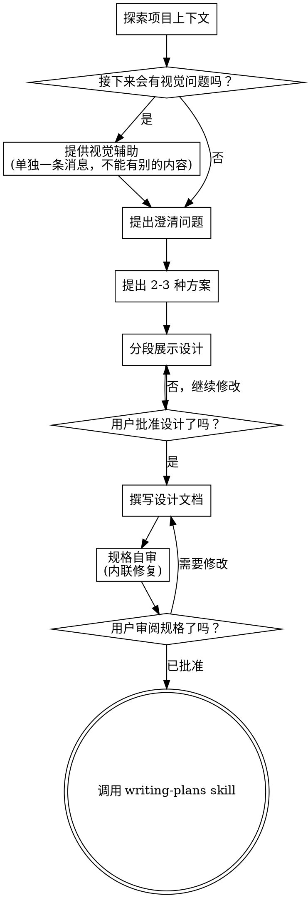

# 把想法头脑风暴成设计

通过自然的协作式对话，把一个想法逐步打磨成完整的设计和规格说明。

先理解当前项目上下文，再一次只问一个问题来收敛想法。等你真正理解要构建什么之后，再给出设计并取得用户批准。

<HARD-GATE>
在你展示设计并获得用户批准之前，不要调用任何实现类 skill，不要写代码，不要脚手架初始化项目，也不要做任何实现动作。无论项目看起来多简单，这条规则都适用。
</HARD-GATE>

## 反模式：“这个太简单了，不需要设计”

每个项目都要走这个流程。待办清单、单函数工具、配置修改，全部都一样。越是“简单”的项目，越容易因为没有审视的假设而浪费时间。设计可以很短（真的非常简单时，几句话也可以），但你必须先展示设计并拿到批准。

## 检查清单

你必须为下面每一项创建任务，并按顺序完成：

1. **探索项目上下文**：检查文件、文档、最近提交
2. **提供视觉辅助**（如果主题会涉及视觉问题）：这必须是一条单独消息，不能和澄清问题放在一起。见下方“视觉辅助”章节。
3. **提出澄清问题**：一次一个，理解目的、约束、成功标准
4. **提出 2-3 种方案**：说明取舍，并给出你的推荐
5. **展示设计**：按复杂度拆分成多个部分展示，并在每一部分后获取用户批准
6. **撰写设计文档**：保存到 `docs/superpowers/specs/YYYY-MM-DD-<topic>-design.md` 并提交
7. **规格自审**：快速内联检查占位符、矛盾、歧义、范围（见下文）
8. **用户审阅书面规格**：在继续前请用户审阅 spec 文件
9. **切换到实现阶段**：调用 `writing-plans` skill 来创建实现计划

## 流程图

**终点状态是调用 `writing-plans`。** 不要调用 `frontend-design`、`mcp-builder` 或任何别的实现类 skill。头脑风暴之后，唯一应该调用的 skill 就是 `writing-plans`。

## 具体流程

**理解这个想法：**

- 先检查当前项目状态（文件、文档、最近提交）
- 在问细节问题前先评估范围：如果请求描述了多个彼此独立的子系统（例如“做一个包含聊天、文件存储、计费和分析的平台”），要立刻指出这一点。不要在一个本来就需要先拆分的项目上浪费问题去磨细节。
- 如果项目对于单个 spec 来说太大，就帮助用户拆成多个子项目：哪些部分相互独立、彼此怎么关联、应该按什么顺序构建。然后先按正常设计流程头脑风暴第一个子项目。每个子项目都应有独立的 spec → plan → implementation 循环。
- 对于范围合适的项目，一次问一个问题来逐步收敛想法
- 可以的话优先用选择题，但开放式问题也可以
- 每条消息只问一个问题；如果一个主题还需要继续探究，就拆成多个问题分别问
- 聚焦在理解：目的、约束、成功标准

**探索方案：**

- 提出 2-3 种不同方案，并说明各自取舍
- 以对话方式给出选项，同时附上你的推荐和理由
- 先给出你最推荐的方案，并解释为什么

**展示设计：**

- 当你认为自己已经理解要构建什么时，再展示设计
- 每个部分的长度按复杂度调整：简单的几句话即可，复杂的可以到 200-300 字
- 每展示完一部分，都询问用户目前看起来是否正确
- 覆盖这些内容：架构、组件、数据流、错误处理、测试
- 如果有哪里说不通，要准备好回退并继续澄清

**为了隔离性和清晰度而设计：**

- 把系统拆成更小的单元，每个单元只有一个清晰职责，通过定义明确的接口通信，并且可以被独立理解和测试
- 对每个单元，你都应该能回答：它做什么、怎么用、依赖什么？
- 别人在不读内部实现的情况下，能理解这个单元的作用吗？你能改内部实现而不影响使用方吗？如果不能，说明边界还不够好。
- 更小、边界更清晰的单元也更方便你工作。你对能在当前上下文里完整装下的代码推理会更好，文件越聚焦，编辑也越可靠。一个文件变得很大，往往说明它做的事太多了。

**在已有代码库中工作：**

- 提方案前先探索当前结构，遵循已有模式
- 如果现有代码中有会影响这次工作的结构性问题（例如文件过大、边界不清、职责缠绕），可以把有针对性的改进纳入设计，这才像一个优秀开发者在真实代码库里的做法
- 不要提出与当前目标无关的重构。保持聚焦。

## 设计之后

**文档：**

- 把已经验证过的设计（spec）写到 `docs/superpowers/specs/YYYY-MM-DD-<topic>-design.md`
  - （如果用户对 spec 存放位置有自己的偏好，以用户偏好为准）
- 如果可用，使用 `elements-of-style:writing-clearly-and-concisely` skill
- 把设计文档提交到 git

**规格自审：**
写完 spec 文档后，要像第一次看它一样重新检查：

1. **占位符检查：** 有没有 `TBD`、`TODO`、未完成章节，或者模糊要求？修掉它们。
2. **内部一致性检查：** 各部分有没有互相矛盾？架构是否和功能描述一致？
3. **范围检查：** 这个 spec 是否足够聚焦，适合产出单个实现计划？还是需要进一步拆分？
4. **歧义检查：** 有没有某个要求可能被理解成两种意思？如果有，就选定一种并写明确。

发现问题就直接内联修复。不需要再额外审一轮，修完继续即可。

**用户审阅关卡：**
在 spec 审阅循环通过后，继续前要请用户先审阅写好的 spec：

> `Spec written and committed to <path>. Please review it and let me know if you want to make any changes before we start writing out the implementation plan.`

等待用户回复。如果他们要求修改，就修改并重新跑一遍 spec 审阅循环。只有用户批准后才能继续。

**实现阶段：**

- 调用 `writing-plans` skill 来创建详细实现计划
- 不要调用任何其他 skill。下一步只能是 `writing-plans`。

## 关键原则

- **一次只问一个问题**：不要用多个问题把用户淹没
- **优先选择题**：如果可能，选择题比开放式问题更容易回答
- **严格执行 YAGNI**：从所有设计中移除不必要的功能
- **探索替代方案**：在定稿前始终提出 2-3 种方案
- **增量验证**：先展示设计，获得批准后再继续
- **保持灵活**：哪里说不通，就回退继续澄清

## 视觉辅助

这是一个基于浏览器的辅助方式，用来在头脑风暴过程中展示模型稿、图示和视觉方案。它是一个工具，不是一种模式。接受这个辅助，意味着当某些问题更适合通过视觉表达时它可以被使用；并不意味着所有问题都必须走浏览器。

**如何提供这个辅助：** 当你预判接下来的问题会涉及视觉内容（模型稿、布局、图表）时，可以先单独征求一次同意：
> `Some of what we're working on might be easier to explain if I can show it to you in a web browser. I can put together mockups, diagrams, comparisons, and other visuals as we go. This feature is still new and can be token-intensive. Want to try it? (Requires opening a local URL)`

**这段邀请必须单独成一条消息。** 不能和澄清问题、上下文总结或任何其他内容混在一起。这条消息必须只包含上面的邀请，不要加别的。等用户回复后再继续。如果用户拒绝，就继续纯文本头脑风暴。

**逐题决策：** 即使用户接受了，也要对每一个问题判断应该用浏览器还是终端。判断标准是：**用户通过“看见它”会不会比“读文字”更容易理解？**

- **使用浏览器**：适合本身就是视觉内容的东西，例如 mockup、线框图、布局比较、架构图、并排视觉设计
- **使用终端**：适合文本内容，例如需求问题、概念选择、取舍列表、A/B/C/D 文本选项、范围决策

一个关于 UI 的问题，并不自动意味着它是视觉问题。比如“这里的 personality 是什么意思？”是概念问题，应使用终端；“哪种向导布局更好？”则是视觉问题，应使用浏览器。

如果用户同意使用视觉辅助，在继续之前先读详细指南：
`skills/brainstorming/visual-companion.md`
