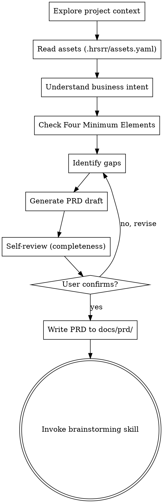

# PRD Refinement Skill

Help refine business intent into a structured, verifiable PRD (Product Requirements Document) through collaborative dialogue.

**Core Principle:** Human-led, AI-assisted. The human provides business intent; the AI helps check completeness and reasonableness. The human confirms the final PRD.

**Output Location:** `docs/prd/YYYY-MM-DD-<feature>-prd.md`

---

## Process Flow



---

## Four Minimum Elements (四类最小要素)

Every PRD MUST contain these four elements. Check each one explicitly:

### ① Business Goal (业务目标)
- What are we doing? Why?
- One sentence summary
- Example: "Support dual-card style in fixed entry to balance acquisition efficiency"

### ② Scenarios & Decisions (场景与判定)
- What business scenarios exist?
- What conditions lead to which branches?
- What are the fallback/abnormal cases?

**Format:** Can be tables, flowcharts, or Given-When-Then

```
Scenario A: Only one dual-card business matched
  - Condition 1: Slot 1 highest priority in allowed range → Show dual-card
  - Condition 2: Slot 1 highest priority not in range → Fallback to 4-slot
  - Condition 3: Slot 1 duplicates existing business → Fallback to 4-slot

Scenario B: Two dual-card businesses matched → Show dual-card directly
Scenario C: No dual-card business matched → Fallback to 4-slot
```

### ③ Input/Output Contract (输入输出契约)
- Which external services are called? What data is returned?
- Field requirements (mandatory vs optional, mapping relationships)

**Example:**
```
Input: Dual-card slot config, user profile, 4-slot candidate list
Output: Dual-card display data + adjusted 4-slot data

Field mapping: Dual-card business name ← Whale Bay bizNameForDouble (mandatory, empty triggers fallback)
```

### ④ Non-Functional Constraints (非功能约束)
- Performance: RT/QPS targets (if applicable)
- Security: Sensitive fields, desensitization requirements
- Compatibility: Backward compatible? Degradation strategy?
- Coverage: Which channels/versions to support? Explicit exclusions?
- Dependencies: Upstream readiness? Downstream impact?

---

## Hard Gate

**The PRD is INCOMPLETE until:**
1. All Four Minimum Elements are present and non-empty
2. AI checks show no major missing items or risks
3. Human explicitly says "can proceed to next step" (可以进入下一步)

**Do NOT invoke brainstorming skill until the PRD is complete and confirmed.**

---

## Step-by-Step

### Step 1: Explore Project Context

Read relevant files to understand:
- Existing codebase structure
- Similar past requirements
- Current interfaces and data models

**Files to check:**
- `docs/prd/*.md` (past PRDs)
- `docs/superpowers/specs/*.md` (past designs)
- `.hrsrr/assets.yaml` (constraints and patterns)
- Relevant source code files

### Step 2: Read Assets

Check `.hrsrr/assets.yaml` for:
- Constraints that apply to this type of requirement
- Historical failure patterns to avoid
- Domain-specific rules

Inject relevant assets into context.

### Step 3: Understand Business Intent

Ask clarifying questions **one at a time**:
- What problem are we solving?
- Who are the users?
- What does success look like?

Use multiple choice when possible.

### Step 4: Check Four Minimum Elements

Explicitly verify each element:

```markdown
□ Business Goal: [present / missing]
□ Scenarios & Decisions: [present / missing]
□ Input/Output Contract: [present / missing]
□ Non-Functional Constraints: [present / missing]
```

For each **missing** element, ask targeted questions to fill the gap.

### Step 5: Identify Gaps

List specific gaps:
```markdown
**Missing Elements:**
1. Business Goal: No clear "why" stated
2. Scenarios: Edge case "duplicate business" not covered
3. Contract: Field "bizNameForDouble" mapping undefined
4. Constraints: No performance requirements

**Suggested Questions:**
- Why is this feature needed? What metric will it improve?
- What happens if the user's highest priority card is not in the allowed range?
- Which field in Whale Bay response provides the business name?
- What's the expected QPS and p99 latency?
```

### Step 6: Generate PRD Draft

Write the PRD in this structure:

```markdown
# PRD: [Feature Name]

> Date: YYYY-MM-DD
> Status: Draft / Confirmed

## Background & Goal (业务目标)

## Scenario List (场景清单)

| Scenario ID | Description | Trigger | Expected Result | Priority |
|-------------|-------------|---------|-----------------|----------|

## Boundary Conditions (边界条件)

## Input/Output Contract (输入输出契约)

## Acceptance Criteria (验收标准)

## Non-Functional Constraints (非功能约束)

## AI Check Record (AI 检查记录)
- Completeness check: [results]
- Identified risks: [risks]
- Suggestions not adopted: [reasons]
```

### Step 7: Self-Review

Checklist:
```markdown
□ All Four Minimum Elements present
□ Scenarios cover main flow and edge cases
□ Acceptance criteria are testable (Given-When-Then or assertions)
□ No contradictions with existing architecture
□ No logical contradictions in scenario decisions
□ Input/output fields clearly defined
```

### Step 8: User Confirmation

Present the PRD and ask:
> "PRD draft complete. Please review the Four Minimum Elements:
> 1. Business Goal: [summary]
> 2. Scenarios: [count] scenarios covering [main points]
> 3. Contract: [key inputs/outputs]
> 4. Constraints: [key constraints]
>
> Are all elements complete? Can we proceed to technical design (brainstorming)?"

**Wait for explicit confirmation.**

### Step 9: Write PRD File

Save to: `docs/prd/YYYY-MM-DD-<feature>-prd.md`

Commit with message:
```bash
git add docs/prd/YYYY-MM-DD-<feature>-prd.md
git commit -m "docs(prd): add PRD for [feature]

Four minimum elements:
- Business goal: [one line]
- Scenarios: [count] covering [main flow]
- Contract: [key inputs] → [key outputs]
- Constraints: [performance/security/etc.]

Co-Authored-By: Claude <noreply@anthropic.com>"
```

### Step 10: Invoke Brainstorming

Once PRD is confirmed and committed:

> "PRD complete and committed. Proceeding to technical design."

**Invoke:** `superpowers:brainstorming`

Pass context:
- PRD file path
- Key scenarios
- Critical constraints

---

## Key Principles

1. **One question at a time** — Don't overwhelm the user
2. **Four Minimum Elements are mandatory** — No exceptions
3. **Human confirms** — AI suggests, human decides
4. **Check assets** — Learn from historical constraints
5. **Testable acceptance criteria** — Every scenario must be verifiable

---

## Terminology

| Term | Definition |
|------|------------|
| Four Minimum Elements | Business Goal, Scenarios & Decisions, Input/Output Contract, Non-Functional Constraints |
| Scenario | A business situation with input-condition-output |
| Acceptance Criteria | Testable assertions derived from scenarios |
| Asset | Historical constraints and patterns from `.hrsrr/assets.yaml` |
| Hard Gate | Mandatory checkpoint that must pass before proceeding |
