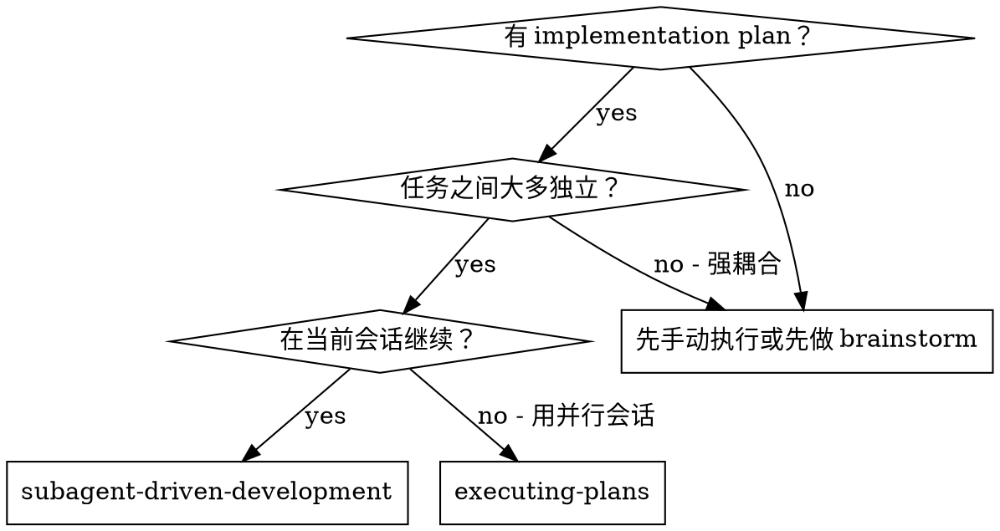
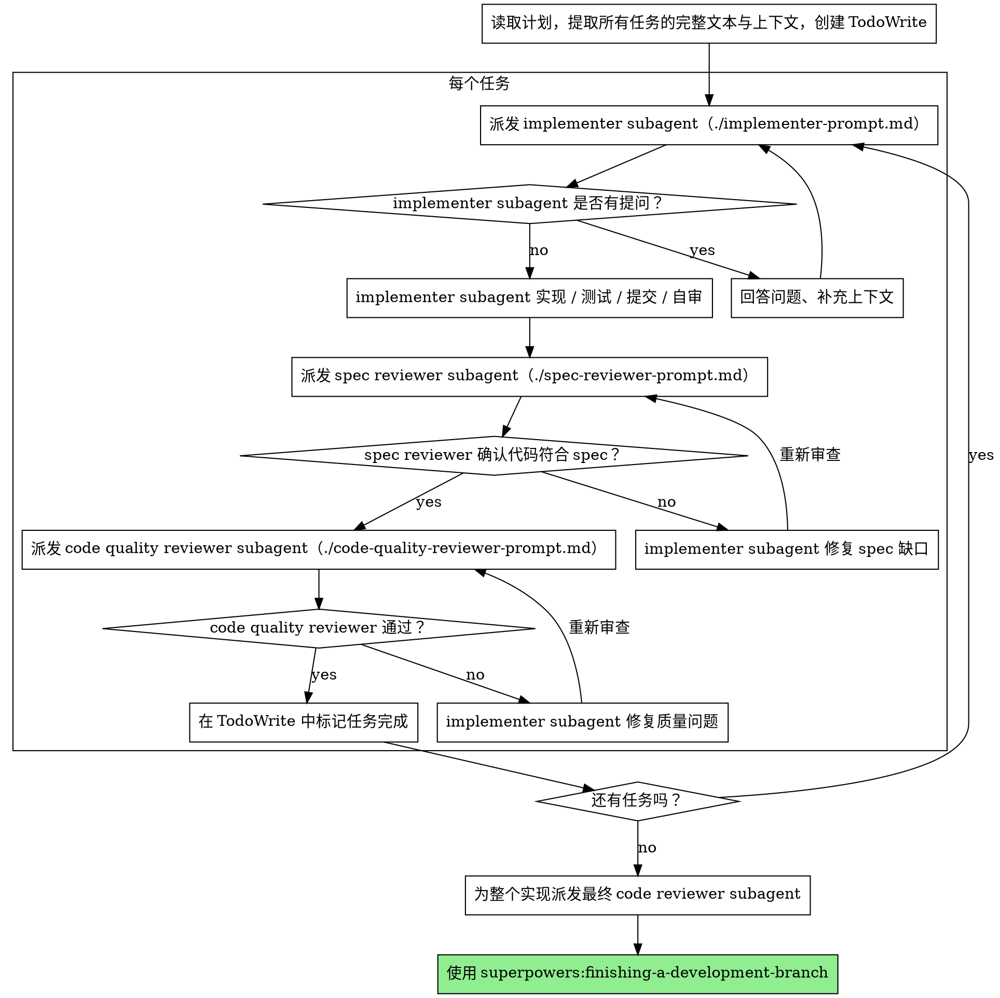

# Subagent-Driven Development（子代理驱动开发）

按任务派发全新的 subagent 来推进计划，每完成一个任务都要经过两阶段审查：先做 spec 合规审查，再做代码质量审查。

**为什么要用 subagent：** 你把任务委派给拥有隔离上下文的专用代理。通过精心设计它们的指令与上下文，你能确保它们聚焦并顺利完成任务。它们永远不应该继承你当前会话的上下文或历史——你要精确地为它们构造所需的信息。同时这样也能保护你自己的上下文，用于协调工作。

**核心原则：** 每个任务一个新鲜的 subagent + 两阶段审查（先 spec 再质量）= 高质量 + 快速迭代

## 何时使用



**对比 Executing Plans（并行会话）：**
- 同一会话（不用切换上下文）
- 每个任务一个新鲜的 subagent（避免上下文污染）
- 每个任务完成后两阶段审查：先 spec 合规，再代码质量
- 迭代更快（任务之间无需 human-in-loop）

## 执行流程



## 模型选择

在每个角色上选用“能够胜任的最弱模型”，以节约成本并提升速度。

**机械性实现任务**（独立函数、spec 清晰、只改 1-2 个文件）：用快速、廉价的模型。计划写得充分时，大多数实现任务都是机械性的。

**集成与判断类任务**（多文件协同、模式匹配、调试）：用标准模型。

**架构、设计与审查类任务**：用当前可用的最强模型。

**任务复杂度信号：**
- 涉及 1-2 个文件 + spec 完整 → 廉价模型
- 涉及多个文件 + 集成相关 → 标准模型
- 需要设计判断或广泛的代码库理解 → 最强模型

## 处理 Implementer 的返回状态

implementer subagent 会返回以下四种状态之一，分别按以下方式处理：

**DONE：** 进入 spec 合规审查。

**DONE_WITH_CONCERNS：** implementer 完成了工作，但提出了疑虑。继续之前先读完这些疑虑。如果疑虑涉及正确性或范围，先处理再进入审查；如果只是观察（例如“这个文件越来越大”），记录下来然后继续审查。

**NEEDS_CONTEXT：** implementer 缺少信息。补足缺失的上下文并重新派发。

**BLOCKED：** implementer 无法完成任务。评估阻塞点：
1. 如果是上下文问题，补充上下文后用同一模型重新派发
2. 如果任务需要更强的推理能力，换更强的模型重新派发
3. 如果任务太大，拆成更小的任务
4. 如果计划本身有问题，上报给人类

**永远不要**忽略升级请求，或者在没有任何改变的情况下让同一模型重试。implementer 说卡住了，就一定有东西需要改变。

## Prompt 模板

- `./implementer-prompt.md` —— 派发 implementer subagent
- `./spec-reviewer-prompt.md` —— 派发 spec 合规审查 subagent
- `./code-quality-reviewer-prompt.md` —— 派发代码质量审查 subagent

## 示例流程

```
你: 我正在用 Subagent-Driven Development 执行这份计划。

[读取一次计划文件：docs/superpowers/plans/feature-plan.md]
[提取全部 5 个任务的完整文本和上下文]
[用 TodoWrite 创建所有任务]

Task 1: 安装 hook 的脚本

[取出 Task 1 的文本和上下文（已提取）]
[派发实现 subagent，附带完整任务文本 + 上下文]

Implementer: “开始之前——hook 应该安装到用户级还是系统级？”

你: “用户级（~/.config/superpowers/hooks/）”

Implementer: “收到，现在开始实现……”
[随后] Implementer:
  - 实现了 install-hook 命令
  - 加了测试，5/5 通过
  - 自审：发现漏了 --force 参数，已补上
  - 已提交

[派发 spec 合规审查]
Spec reviewer: ✅ 符合 spec —— 所有需求都已满足，没有多余内容

[拿到 git SHA，派发代码质量审查]
Code reviewer: 优点：测试覆盖好、干净。问题：无。通过。

[标记 Task 1 完成]

Task 2: 恢复模式

[取出 Task 2 的文本和上下文（已提取）]
[派发实现 subagent，附带完整任务文本 + 上下文]

Implementer: [没有提问，直接实现]
Implementer:
  - 增加了 verify/repair 模式
  - 8/8 测试通过
  - 自审：无问题
  - 已提交

[派发 spec 合规审查]
Spec reviewer: ❌ 问题：
  - 缺失：进度上报（spec 写的是“每 100 项上报一次”）
  - 多余：加了 --json 参数（未要求）

[Implementer 修复]
Implementer: 移除 --json 参数，补上进度上报

[Spec reviewer 重审]
Spec reviewer: ✅ 现在符合 spec

[派发代码质量审查]
Code reviewer: 优点：稳健。问题（Important）：魔法数字（100）

[Implementer 修复]
Implementer: 抽出 PROGRESS_INTERVAL 常量

[Code reviewer 重审]
Code reviewer: ✅ 通过

[标记 Task 2 完成]

...

[所有任务完成后]
[派发最终 code-reviewer]
Final reviewer: 所有需求均已满足，可以合并

完成！
```

## 优势

**对比手动执行：**
- subagent 天然遵循 TDD
- 每个任务上下文全新（不混淆）
- 并行安全（subagent 之间不会互相干扰）
- subagent 可以提问（工作前和工作中都可以）

**对比 Executing Plans：**
- 同一会话（无交接）
- 连续推进（不用等待）
- 审查检查点自动发生

**效率收益：**
- 无读文件开销（controller 直接提供完整文本）
- controller 精确筛选所需上下文
- subagent 一开始就拿到完整信息
- 提问在动手之前就浮现（而不是之后）

**质量闸：**
- 自审在交接前就抓到问题
- 两阶段审查：先 spec 合规，再代码质量
- 审查循环确保修复真的生效
- spec 合规防止多做或少做
- 代码质量确保实现本身是良构的

**成本：**
- subagent 调用次数更多（每任务 1 个 implementer + 2 个 reviewer）
- controller 前置工作更多（先把全部任务提取出来）
- 审查循环带来更多迭代
- 但能更早发现问题（比事后 debug 便宜）

## 红旗警报

**绝不：**
- 未经用户明确同意就在 main/master 分支上开始实现
- 跳过审查（spec 合规或代码质量任一都不行）
- 带着未修复的问题继续往下做
- 并行派发多个实现 subagent（会冲突）
- 让 subagent 自己去读计划文件（应直接提供完整文本）
- 省略场景性上下文（subagent 必须理解当前任务在整体中的位置）
- 忽视 subagent 的提问（必须先回答再让它推进）
- 在 spec 合规上接受“差不多就行”（reviewer 提出问题 = 未完成）
- 跳过审查循环（reviewer 提问题 = implementer 修 = 再审）
- 用 implementer 的自审替代真正的审查（两者都必须有）
- **在 spec 合规尚未 ✅ 前就开始代码质量审查**（顺序错误）
- 任一审查还有未解决问题时就推进到下一个任务

**subagent 提问时：**
- 回答清晰、完整
- 必要时补充更多上下文
- 不要催它赶快开始实现

**reviewer 发现问题时：**
- 由 implementer（同一 subagent）去修
- reviewer 再次审查
- 重复直到通过
- 不要跳过重审

**subagent 任务失败时：**
- 派发专门的修复 subagent，附带明确指令
- 不要手动去修（会污染上下文）

## 集成关系

**必需的工作流 skill：**
- **superpowers:using-git-worktrees** —— 必需：开始前先搭建隔离 workspace
- **superpowers:writing-plans** —— 产出本 skill 所执行的计划
- **superpowers:requesting-code-review** —— reviewer subagent 使用的 code review 模板
- **superpowers:finishing-a-development-branch** —— 所有任务完成后的收尾

**subagent 应使用：**
- **superpowers:test-driven-development** —— subagent 对每个任务都遵循 TDD

**替代工作流：**
- **superpowers:executing-plans** —— 采用并行会话（而非同会话）的方式执行
