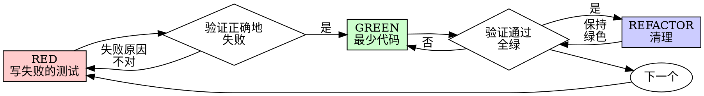

# 测试驱动开发（TDD）

## 概述

先写测试。看它失败。再写最少的代码让它通过。

**核心原则：** 如果你没亲眼看到测试失败，你就不知道它是否在测试正确的东西。

**违反规则的字面含义就是违反规则的精神。**

## 何时使用

**始终：**
- 新功能
- Bug 修复
- 重构
- 行为变更

**例外（与你的人类搭档确认）：**
- 一次性原型
- 生成的代码
- 配置文件

想着"就这一次跳过 TDD"？停。那是在合理化。

## 铁律

```
没有先写出失败的测试，就不写生产代码
```

在测试之前写了代码？删掉。重新来。

**没有例外：**
- 不要把它留作"参考"
- 写测试时不要"改编"它
- 不要看它
- 删除就是删除

从测试出发重新实现。就这样。

## 红-绿-重构



### RED —— 写失败的测试

写一个最小的测试，说明应当发生什么。

<Good>
```typescript
test('retries failed operations 3 times', async () => {
  let attempts = 0;
  const operation = () => {
    attempts++;
    if (attempts < 3) throw new Error('fail');
    return 'success';
  };

  const result = await retryOperation(operation);

  expect(result).toBe('success');
  expect(attempts).toBe(3);
});
```
名称清晰，测试真实行为，只测一件事
</Good>

<Bad>
```typescript
test('retry works', async () => {
  const mock = jest.fn()
    .mockRejectedValueOnce(new Error())
    .mockRejectedValueOnce(new Error())
    .mockResolvedValueOnce('success');
  await retryOperation(mock);
  expect(mock).toHaveBeenCalledTimes(3);
});
```
名称含糊，测的是 mock 而不是代码
</Bad>

**要求：**
- 一种行为
- 清晰的名称
- 真实的代码（除非不得不用，否则不要 mock）

### 验证 RED —— 看它失败

**必须。绝不跳过。**

```bash
npm test path/to/test.test.ts
```

确认：
- 测试失败（而不是报错）
- 失败信息符合预期
- 失败是因为功能缺失（而不是拼写错误）

**测试通过了？** 你在测试已有行为。修正测试。

**测试报错？** 修正错误，再跑直到它以正确的原因失败。

### GREEN —— 最少代码

写最简单的代码让测试通过。

<Good>
```typescript
async function retryOperation<T>(fn: () => Promise<T>): Promise<T> {
  for (let i = 0; i < 3; i++) {
    try {
      return await fn();
    } catch (e) {
      if (i === 2) throw e;
    }
  }
  throw new Error('unreachable');
}
```
刚好够通过
</Good>

<Bad>
```typescript
async function retryOperation<T>(
  fn: () => Promise<T>,
  options?: {
    maxRetries?: number;
    backoff?: 'linear' | 'exponential';
    onRetry?: (attempt: number) => void;
  }
): Promise<T> {
  // YAGNI
}
```
过度设计
</Bad>

不要添加功能、不要重构其他代码、不要超出测试要求地"改进"。

### 验证 GREEN —— 看它通过

**必须。**

```bash
npm test path/to/test.test.ts
```

确认：
- 测试通过
- 其他测试仍然通过
- 输出干净（没有错误、警告）

**测试失败？** 修代码，不是修测试。

**其他测试失败？** 现在就修。

### REFACTOR —— 清理

只在绿灯之后：
- 消除重复
- 改进命名
- 提取辅助函数

保持测试绿色。不要添加行为。

### 重复

为下一个功能写下一个失败的测试。

## 好的测试

| 品质 | 好 | 坏 |
|---------|------|-----|
| **最小** | 只测一件事。名字里有"和"？拆开。 | `test('validates email and domain and whitespace')` |
| **清晰** | 名称描述行为 | `test('test1')` |
| **体现意图** | 展示期望的 API | 掩盖代码应当做什么 |

## 为什么顺序很重要

**"我写完之后再写测试来验证它能工作"**

事后写的测试立刻就过。立刻通过什么都证明不了：
- 可能在测错的东西
- 可能在测实现而不是行为
- 可能漏掉你忘记的边界情况
- 你从来没见它抓住过 Bug

测试优先逼你看到测试失败，证明它真的在测试某件事。

**"我已经手工测过所有边界情况了"**

手工测试是临时的。你自以为都测过了，但：
- 没有记录你测过什么
- 代码变更时无法重跑
- 压力下容易漏掉某些情况
- "我试过时它能工作" ≠ 全面覆盖

自动化测试是系统化的。它们每次都以同样方式运行。

**"删掉 X 小时的工作太浪费了"**

沉没成本谬误。时间已经花掉了。你现在的选择是：
- 删掉并用 TDD 重写（再花 X 小时，信心高）
- 留着它事后补测试（30 分钟，信心低，很可能有 Bug）

"浪费"是留着你无法信任的代码。没有真实测试的可工作代码就是技术债。

**"TDD 太教条，务实意味着灵活"**

TDD 本来就是务实：
- 在提交前发现 Bug（比事后调试更快）
- 防止回归（测试立即抓到破坏）
- 记录行为（测试演示如何使用代码）
- 支撑重构（放心改，测试抓破坏）

"务实"捷径 = 在生产环境调试 = 更慢。

**"事后测试能达到同样目标——重点是精神不是仪式"**

不。事后测试回答"它做了什么？" 先写测试回答"它应当做什么？"

事后测试被你的实现带偏。你测的是你构建的东西，不是需求。你验证的是你记得的边界情况，不是你发现的。

先写测试强迫你在实现之前发现边界情况。事后测试则验证你是否记全了（你没记全）。

事后写 30 分钟测试 ≠ TDD。你得到了覆盖率，失去了"测试确实有效"的证据。

## 常见的合理化

| 借口 | 现实 |
|--------|---------|
| "太简单了不值得测" | 简单代码也会坏。测试只要 30 秒。 |
| "我事后再测" | 立刻通过的测试什么都证明不了。 |
| "事后测试能达到同样目标" | 事后 = "它做了什么？" 先写 = "它应当做什么？" |
| "我已经手工测过了" | 临时 ≠ 系统化。没有记录，无法重跑。 |
| "删掉 X 小时太浪费" | 沉没成本谬误。留着未验证的代码就是技术债。 |
| "留作参考，先写测试" | 你会去改编它。那就是事后测试。删除就是删除。 |
| "需要先探索一下" | 可以。扔掉探索代码，再以 TDD 开始。 |
| "难测 = 设计不清" | 听测试的。难测 = 难用。 |
| "TDD 会拖慢我" | TDD 比调试快。务实 = 先写测试。 |
| "手工测更快" | 手工证明不了边界情况。每次改动你都要重测。 |
| "已有代码本来就没测试" | 你正在改进它。给已有代码补测试。 |

## 红旗信号 —— 停下并重新开始

- 测试之前就有代码
- 在实现之后才写测试
- 测试一次就通过
- 说不出测试为何失败
- 测试"之后再加"
- 合理化"就这一次"
- "我已经手工测过了"
- "事后测试能达到同样目的"
- "重点是精神不是仪式"
- "留作参考"或"改编已有代码"
- "已经花了 X 小时，删掉太浪费"
- "TDD 太教条，我在务实"
- "这次不一样因为……"

**以上全部意味着：删掉代码。用 TDD 重新开始。**

## 示例：Bug 修复

**Bug：** 空邮箱被接受

**RED**
```typescript
test('rejects empty email', async () => {
  const result = await submitForm({ email: '' });
  expect(result.error).toBe('Email required');
});
```

**验证 RED**
```bash
$ npm test
FAIL: expected 'Email required', got undefined
```

**GREEN**
```typescript
function submitForm(data: FormData) {
  if (!data.email?.trim()) {
    return { error: 'Email required' };
  }
  // ...
}
```

**验证 GREEN**
```bash
$ npm test
PASS
```

**REFACTOR**
如有需要，为多个字段抽取验证逻辑。

## 验证清单

在标记工作完成之前：

- [ ] 每个新函数/方法都有测试
- [ ] 在实现前看着每个测试失败
- [ ] 每个测试以预期的原因失败（功能缺失，而不是拼写错误）
- [ ] 为每个测试写了最少的代码以通过
- [ ] 所有测试通过
- [ ] 输出干净（没有错误、警告）
- [ ] 测试使用真实代码（仅在不得已时 mock）
- [ ] 覆盖边界情况和错误

没法全部打勾？你跳过了 TDD。重新开始。

## 卡住时

| 问题 | 解决 |
|---------|----------|
| 不知道怎么测 | 写出你希望的 API。先写断言。问你的人类搭档。 |
| 测试过于复杂 | 设计过于复杂。简化接口。 |
| 必须 mock 一切 | 代码耦合过重。使用依赖注入。 |
| 测试准备代码巨大 | 抽取辅助函数。仍复杂？简化设计。 |

## 与调试的整合

发现 Bug 了？写一个能复现它的失败测试。遵循 TDD 循环。测试同时证明修复并防止回归。

绝不在没有测试的情况下修 Bug。

## 测试反模式

在添加 mock 或测试工具时，请阅读 @testing-anti-patterns.md 以避开常见陷阱：
- 测试 mock 行为而非真实行为
- 给生产类添加仅供测试的方法
- 在不理解依赖的情况下 mock

## 最终规则

```
生产代码 → 先存在并先失败过的测试
否则 → 不是 TDD
```

未经你的人类搭档允许，没有例外。
