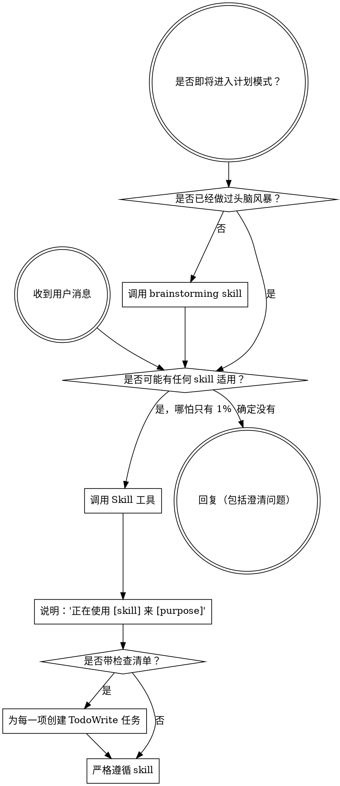

<SUBAGENT-STOP>
如果你是被派发出来执行某个具体任务的 subagent，请跳过这个 skill。
</SUBAGENT-STOP>

<EXTREMELY-IMPORTANT>
如果你觉得正在做的事哪怕只有 1% 的可能适用某个 skill，你都绝对必须调用这个 skill。

如果某个 skill 适用于你的任务，你就没有选择权。你必须使用它。

这不是可以商量的事。这不是可选项。你不能靠自我合理化绕过去。
</EXTREMELY-IMPORTANT>

## 指令优先级

Superpowers skills 会覆盖默认 system prompt 的行为，但**用户指令永远优先**：

1. **用户的显式指令**（`CLAUDE.md`、`GEMINI.md`、`AGENTS.md`、直接请求）优先级最高
2. **Superpowers skills**：当与默认 system 行为冲突时，以 skill 为准
3. **默认 system prompt**：优先级最低

如果 `CLAUDE.md`、`GEMINI.md` 或 `AGENTS.md` 说“不要用 TDD”，而某个 skill 说“必须用 TDD”，那就遵从用户指令。控制权在用户手里。

## 如何访问 Skills

**在 Claude Code 中：** 使用 `Skill` 工具。当你调用一个 skill 时，它的内容会被加载并展示给你，你要直接遵循它。不要再用 `Read` 工具去读 skill 文件。

**在 Copilot CLI 中：** 使用 `skill` 工具。skills 会从已安装插件中自动发现。这里的 `skill` 工具和 Claude Code 的 `Skill` 工具作用相同。

**在 Gemini CLI 中：** 通过 `activate_skill` 工具激活 skill。Gemini 会在会话启动时加载 skill 元数据，并在需要时按需激活完整内容。

**在其他环境中：** 请查看你所在平台的文档，确认该如何加载 skills。

## 平台适配

skills 默认使用 Claude Code 的工具命名。非 Claude Code 平台请参考：`references/copilot-tools.md`（Copilot CLI）、`references/codex-tools.md`（Codex）来查对应工具。Gemini CLI 用户会通过 `GEMINI.md` 自动拿到工具映射。

# 使用 Skills

## 规则

**在做任何回复或动作之前，先调用相关或被请求的 skill。** 只要某个 skill 有 1% 的可能适用，你就应该先调用它来检查。如果后来发现这个 skill 不适合当前场景，那你可以不用继续按它执行。

## 红旗信号

一旦你脑子里冒出这些想法，就该立刻停下，因为你正在自我合理化：

| 想法 | 现实 |
|---------|---------|
| “这只是个简单问题” | 问题也是任务。先检查 skills。 |
| “我得先多拿点上下文” | 检查 skill 必须发生在澄清问题之前。 |
| “我先探索一下代码库” | skills 会告诉你该怎么探索。先检查。 |
| “我可以先随便看看 git/文件” | 文件没有会话上下文。先检查 skill。 |
| “我先收集点信息再说” | skills 会告诉你该怎么收集信息。 |
| “这事不需要正式 skill” | 只要有 skill，就用它。 |
| “我记得这个 skill 是什么” | skills 会演进。读当前版本。 |
| “这不算任务” | 只要有动作，就是任务。先检查 skill。 |
| “这个 skill 太小题大做了” | 简单的事经常会变复杂。照样要用。 |
| “我先做这一小步再说” | 在做任何事之前先检查。 |
| “这样做看起来很高效” | 没有纪律的行动只会浪费时间。skills 就是为防止这个。 |
| “我知道这是什么意思” | 知道概念 ≠ 真正用了 skill。去调用它。 |

## Skill 优先级

当多个 skill 都可能适用时，按这个顺序来：

1. **先用流程类 skill**（如 `brainstorming`、`debugging`）- 它们决定你该如何处理任务
2. **再用实现类 skill**（如 `frontend-design`、`mcp-builder`）- 它们指导具体执行

“Let’s build X” → 先 `brainstorming`，再实现类 skills。
“Fix this bug” → 先 `debugging`，再领域相关 skills。

## Skill 类型

**Rigid（刚性）**：比如 TDD、debugging。必须严格遵守，不要为了省事去“灵活解释”。

**Flexible（柔性）**：比如模式类 skill。原则要遵循，但可以按上下文调整。

具体属于哪类，由 skill 自己说明。

## 用户指令

用户指令规定的是 **做什么（WHAT）**，不是 **怎么做（HOW）**。像“加一个 X”或“修复 Y”这样的要求，并不意味着你可以跳过工作流。
