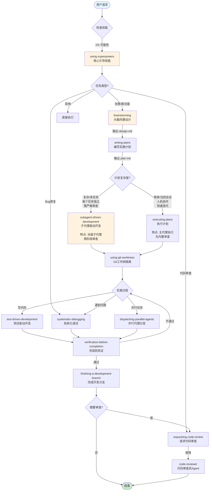
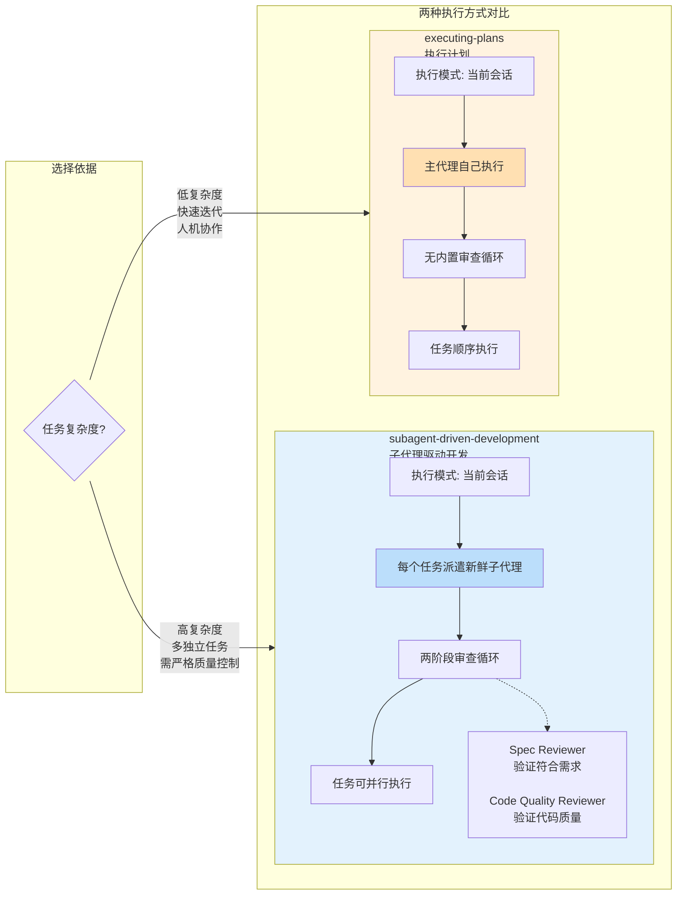
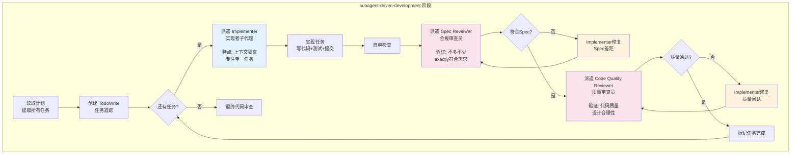
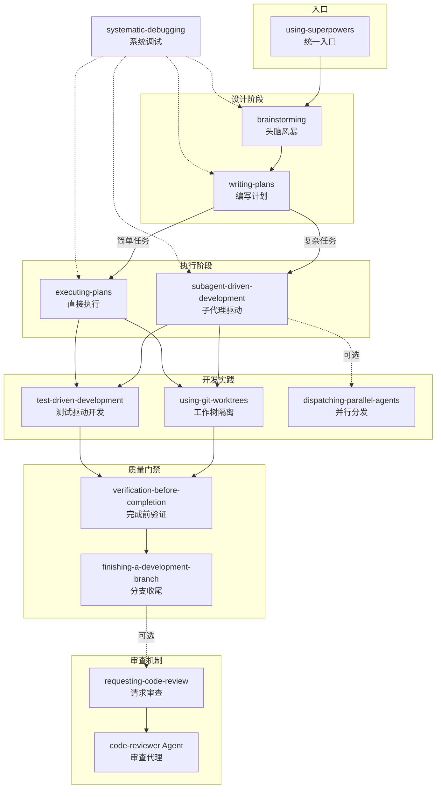
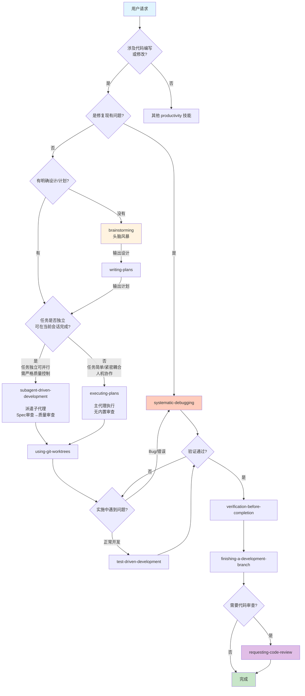
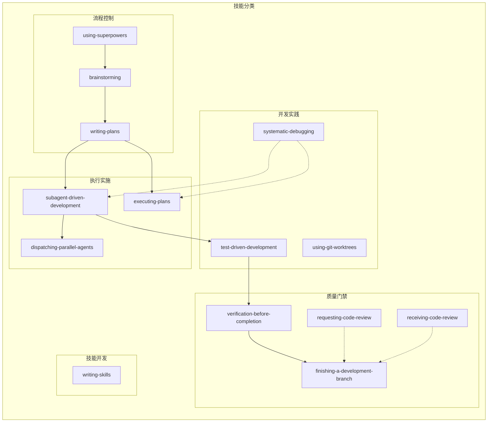
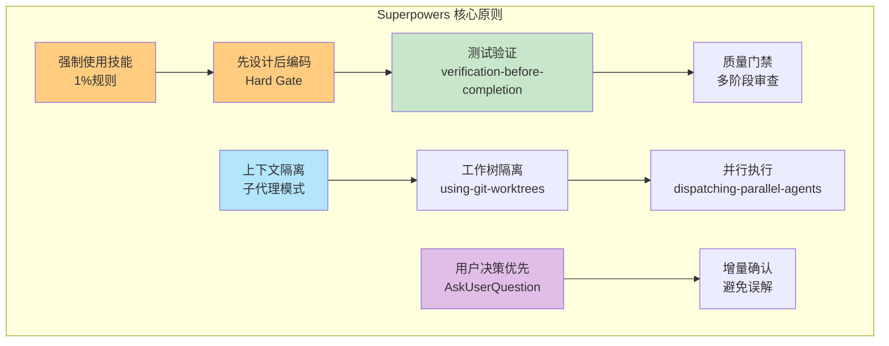

# Superpowers 技能流程与关系图

## 1. 核心工作流程（主流程）



## 2. SDD vs Executing-Plans 核心区别



## 3. 子代理驱动开发（SDD）内部详细流程



## 3. 技能依赖关系



## 4. 用户请求路由决策树



## 5. 技能分类矩阵



## 6. 关键原则说明



---

## 7. SDD vs Executing-Plans 关键区别对照表

| 维度 | subagent-driven-development | executing-plans |
|------|----------------------------|-----------------|
| **执行主体** | 派遣新鲜子代理（每个任务一个） | 主代理自己执行 |
| **上下文隔离** | ✅ 完全隔离（子代理只看任务描述） | ❌ 继承主会话上下文 |
| **审查机制** | ✅ 两阶段强制审查（Spec→Quality） | ❌ 无内置审查 |
| **任务关系** | 任务独立，可并行 | 任务顺序，依赖主代理协调 |
| **人机协作** | 低（子代理自动执行） | 高（主代理可询问用户） |
| **适用场景** | 复杂实现、严格质量要求 | 简单任务、快速迭代、探索性 |
| **成本** | 较高（多子代理+多轮审查） | 较低（单会话） |
| **速度** | 较慢（审查循环） | 较快（无审查门槛） |

### 选择决策

```
任务是否独立？
    ├─ 是 → 是否需要严格质量控制？
    │         ├─ 是 → subagent-driven-development
    │         └─ 否 → executing-plans
    └─ 否 → executing-plans（顺序执行更合适）
```

---

## 图例说明

| 颜色 | 含义 |
|------|------|
| 🟧 橙色 | 核心/入口技能 |
| 🟦 蓝色 | 主要流程技能 |
| 🟩 绿色 | 质量/验证技能 |
| 🟥 红色 | 调试/修复技能 |
| 🟪 紫色 | 审查/代码质量 |
| ⬜ 白色 | 支持/通用技能 |
